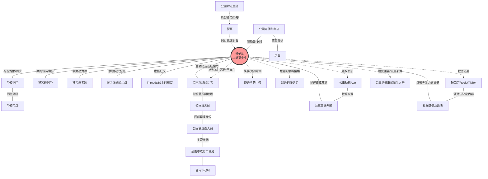

# 楊子萱的利害關係人地圖描述

我們將繪製一個以子萱為核心的網狀地圖，包含以下層次：

1. **核心圈層（生活重心與壓力源）**：包含給予學業壓力的補習班老師、同儕關係、以及在公園中與她「同在卻無話」的朋友。
2. **中間圈層（公園物理環境與直接互動）**：包含在公園中與她產生空間重疊的長輩、讓她感到焦慮的陌生人，以及她數位生活中的互動對象（如影音平台的演算法）。
3. **外圍與間接關係（系統與監管）**：包含造成她必須在公園停留的交通系統（公車站）、公園的管理方，以及間接影響她心理狀態的家庭與教育體制。

---

### Mermaid 圖表代表

### 資料細節解析：

* **學業鏈條**：子萱在公園的行為（滑手機、抱怨）深受「補習班老師」與「段考」影響。這解釋了她為什麼身在公園，心卻在別處。
* **數位島嶼**：**演算法（TechCorp）** 與 **短影音（Shorts）** 是她躲避現實社交的盾牌，但也是造成她分心與焦慮的間接推手。
* **跨世代衝突**：**玩牌長者（Elders）** 與子萱之間的關係是「空間重疊但心理排斥」。長輩的「主動詢問（如：今天沒上課？）」對她而言是微侵略，這種不對等的社交壓力是我們要解決的核心問題。

這張地圖清楚地顯示，子萱的問題不在於「沒有 App」，而在於她被多重的壓力、焦慮與數位誘惑包圍，導致她在台南公園這個場域中，找不到一個舒適的「心理安放處」。