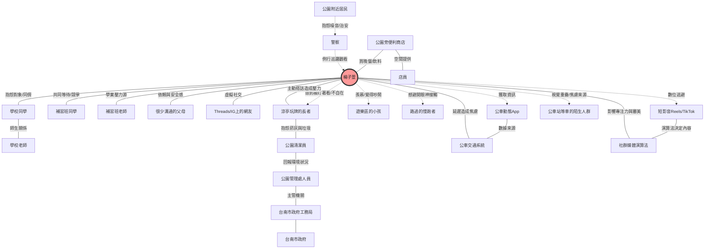

# <span class="text-white drop-shadow-xl text-6xl font-bold">台南公園輕社交平台</span>
<p class="text-white/80 tracking-widest mt-4 block font-light text-2xl">從行為觀察到「反思型社交」的設計實踐</p>

<div class="pt-12">
  <div class="inline-block backdrop-blur-md bg-white/10 border border-white/20 px-8 py-4 rounded-2xl shadow-2xl">
    <p class="font-mono text-sm">使用者經驗設計個案研究</p>
  </div>
</div>

<!--
各位評審老師、同學大家好，我們是第Ｘ組。今天要與大家分享的主題是「台南公園輕社交平台」。這是一個專為害羞、慢熟的青少年設計的數位解方，旨在幫助他們在公共空間中，找到屬於自己的舒適社交節奏。
-->

---

<Toc />

<!--
這是我們今天的報告大綱。我們會先從專案的核心目標與價值開始，解釋為什麼我們選擇「研究先行」的策略。接著進入設計方法，展示我們如何透過田野觀察與數據分析來定義問題。第三部分是設計解答，我們會透過使用者故事與實際介面，展示我們的解決方案。最後，我們會分享經過驗證後的設計迭代與專案價值。
-->

---
layout: section
---

# PART I
## 專案介紹 (INTRODUCTION)

<!--
首先進入第一部分：專案介紹。
-->

---

## 候選場域初步掃描

在進入深度研究前，我們針對台南三個具備不同社會特性的場域進行了掃描。

<div class="flex flex-row gap-4"> 
  <div v-click class="p-4 bg-white/5 rounded-lg border border-white/10 mb-4">
    <h3 class="font-bold text-orange-300 mb-2">A. 大東夜市</h3>
    <p class="text-xs text-white/80"><b>特質</b>：庶民生活的煙火氣，高度隨性與混亂。</p>
    <p class="text-xs text-white/60 mt-2"><b>潛力</b>：解決「擠」與「等」的效率問題。</p>
  </div>

  <div v-click class="p-4 bg-white/5 rounded-lg border border-white/10 mb-4">
    <h3 class="font-bold text-sky-300 mb-2">B. 銀同社區</h3>
    <p class="text-xs text-white/80"><b>特質</b>：老街記憶與歷史積澱，充滿生活感。</p>
    <p class="text-xs text-white/60 mt-2"><b>潛力</b>：聲音敘事與歷史傳承。</p>
  </div>

  <div v-click class="p-4 bg-white/5 rounded-lg border border-white/10 mb-4">
    <h3 v-mark.circle.red="4" class="font-bold text-teal-300 mb-2">C. 台南公園</h3>
    <p class="text-xs text-white/80"><b>特質</b>：完全去目的化的開放空間，無消費門檻。</p>
    <p class="text-xs text-white/60 mt-2"><b>潛力</b>：解決「行為異化」與「低壓力社交」。</p>
  </div>
</div>

<!--
我們最初挑選了三個地點。大東夜市代表了熱鬧的商業行為，銀同社區代表了歷史與文化的傳承。而台南公園，則是一個非常特殊的「去目的化」空間。
-->

---

## 決策核心：為何選擇台南公園？

經過評估，我們認為台南公園最具備 UX 研究價值，原因有二：

<div class="grid grid-cols-2 gap-8 text-left mt-8">
  <div v-click class="p-5 border-l-4 border-teal-400 bg-white/5">
    <h3 class="font-bold text-xl mb-2">1. 「去角色化」帶來的行為多樣性</h3>
    <p class="text-white/80 text-sm leading-relaxed">夜市的人是顧客，社區的人是鄰居。唯有在公園，人們可以「只是在那裡」。這種角色的缺失，讓我們能觀察到最純粹的使用者心理狀態（如焦慮、放鬆、孤獨）。</p>
  </div>

  <!-- TODO: this doesn't make sense. we only do the field study after selection of the candidate sites -->
  <div v-after class="p-5 border-l-4 border-teal-400 bg-white/5">
    <h3 class="font-bold text-xl mb-2">2. 挑戰「數位孤島」現象</h3>
    <p class="text-white/80 text-sm leading-relaxed">我們觀察到公園中存在嚴重的「數位孤島」——人們身處開放空間，卻退縮回手機的個人世界。這提供了一個巨大的空白，讓我們去設計一個能連結數位與實體的系統。</p>
  </div>
</div>

<!--
為什麼是台南公園？首先，它是唯一一個「沒有角色包袱」的地方。在夜市你是消費者，在社區你是居民，但在公園，你就是你自己。這讓我們能觀察到最真實的行為。其次，這裡的「數位孤島」現象最嚴重，人們身體在公園，心卻在手機裡。這正是我們想要挑戰的題目：如何透過數位手段，把人拉回現實？
-->

---

## 場域影像紀錄

<div class="grid grid-cols-3 gap-4 mt-8">
  <div class="aspect-video bg-gray-800/50 rounded-lg flex items-center justify-center border border-white/10">
    <!--  -->
    <p class="text-white/30 text-sm">大東夜市 (Placeholder)</p>
  </div>
  <div class="aspect-video bg-gray-800/50 rounded-lg flex items-center justify-center border border-white/10">
    <!--  -->
    <p class="text-white/30 text-sm">銀同社區 (Placeholder)</p>
  </div>
  <div class="aspect-video bg-teal-900/30 rounded-lg flex items-center justify-center border border-teal-500/30">
    <!--  -->
    <p class="text-teal-300/50 text-sm">台南公園 (Placeholder)</p>
  </div>
</div>

<!--
這裡是我們實地走訪三個場域的影像紀錄。（待補圖片）
-->

---

## 專案目標與價值主張

<div class="grid grid-cols-2 gap-8 text-left items-center pt-4">
  <div class="backdrop-blur-sm bg-white/5 p-4 rounded-lg border border-white/10">
    <h3 class="font-bold text-2xl mb-4">專案目標</h3>
    <p class="text-white/80">本專案旨在探索如何透過一個數位平台，幫助青少年在一個感覺<b>低壓力、舒適、且忠於自我個性</b>的環境中進行社交。</p>
    <p class="text-white/80 mt-4">我們選擇以<b>台南公園</b>為中心，設計一個讓青少年可以發起或參與小型、「氛圍導向」活動的平台。</p>
  </div>
  <div class="backdrop-blur-sm bg-white/5 p-4 rounded-lg border border-white/10">
    <h3 class="font-bold text-2xl mb-4">價值主張</h3>
    <p class="text-white/80">與其推廣大型、吵雜或高度社交的活動，我們的設計更專注於：</p>
    <p class="text-teal-300 font-bold mt-4 text-lg">「幫助害羞或慢熟的使用者，在他們自己的步調下，安全地邁出社交的第一步。」</p>
  </div>
</div>

<!--
因此，我們的專案目標確立為：在台南公園，為青少年打造一個低壓力的社交平台。我們的核心價值主張是「降低門檻，而非改變個性」。我們不強迫內向者變外向，而是提供一個適合他們的環境，讓他們能安全地邁出第一步。
-->

---
layout: section
---

# PART II
## 設計方法 (DESIGN METHODS)

<!--
接下來進入第二部分：設計方法。我們將展示如何透過嚴謹的質化與量化研究，一步步收斂出我們的設計核心。
-->

---

## 為什麼不直接開發 App？

<p v-click>我們拒絕犯下「先射箭再畫靶」(The Texas Sharpshooter Fallacy) 的錯誤。</p>

<div class="grid grid-cols-2 gap-8 text-left mt-8">
  <div v-click class="p-4 border-l-4 border-red-400 bg-white/5">
    <h3 class="font-bold text-xl mb-2 text-red-300">先射箭再畫靶</h3>
    <p class="text-white/80 mb-2">許多專案往往先決定了「要做一個 App」，然後才去尋找「可以用在哪裡」。</p>
    <p class="text-white/60 text-sm">👉 這導致產品往往解決了表面的便利性（如：找不到活動），卻忽視了深層的心理門檻（如：不敢參加）。</p>
  </div>
  <div v-after class="p-4 border-l-4 border-teal-400 bg-white/5">
    <h3 class="font-bold text-xl mb-2 text-teal-300">先觀察再設計</h3>
    <p class="text-white/80 mb-2">我們選擇先走入場域，透過觀察使用者的真實行為，找出「潛在需求」。</p>
    <p class="text-white/60 text-sm">👉 唯有透過田野調查，我們才能發現「數位孤島」現象，並定義出真正的設計機會點。</p>
  </div>
</div>

<!--
在專案開始時，我們問了自己一個問題：為什麼不直接開始寫程式？因為我們不想犯「先射箭再畫靶」的錯誤。如果我們預設了「要做一個活動報名 App」，我們就只會看到「活動資訊不足」的問題。但透過先進入場域觀察，我們發現真正的問題不是「沒有活動」，而是「不敢參加」。這個洞察，只有透過研究先行才能獲得。
-->

---
layout: default
class: 'p-8'
---

# 田野觀察：12 組行為圖鑑 (Behavioral Atlas)

我們捕捉了場域中 12 組使用者的「標誌性動作」，揭示他們在公共空間裡的真實狀態。

<div class="grid grid-cols-4 gap-3 mt-6 text-xs leading-tight text-left">

  <div v-click class="border border-white/20 bg-white/5 p-3 rounded hover:bg-white/10 transition">
    <strong class="block mb-1 opacity-90">(U1) 自行車小孩</strong>
    <p class="opacity-70">獨自騎車觀察路人，熟悉路線，隨性靠邊避讓。</p>
  </div>

  <div v-click class="border border-white/20 bg-white/5 p-3 rounded hover:bg-white/10 transition">
    <strong class="block mb-1 opacity-90">(U2) 漫步情侶</strong>
    <p class="opacity-70">牽手同時單手滑手機，低頭緩慢走路對話。</p>
  </div>

  <div v-click class="border border-white/20 bg-white/5 p-3 rounded hover:bg-white/10 transition">
    <strong class="block mb-1 opacity-90">(U3) 長凳友人</strong>
    <p class="opacity-70">分享手機內容大笑，在樹蔭下等人聚合。</p>
  </div>

  <div v-click class="border border-white/20 bg-white/5 p-3 rounded hover:bg-white/10 transition">
    <strong class="block mb-1 opacity-90">(U4) 涼亭長者</strong>
    <p class="opacity-70">儀式化地整理水壺、點菸、抖灰，並將腳架上石椅。</p>
  </div>

  <div v-click class="border border-white/20 bg-white/5 p-3 rounded hover:bg-white/10 transition">
    <strong class="block mb-1 opacity-90">(U5) 玩牌長者</strong>
    <p class="opacity-70">圓形箭頭遷牌、輕點桌面三下，全神貫注局勢。</p>
  </div>

  <div v-click class="border border-white/20 bg-white/5 p-3 rounded hover:bg-white/10 transition">
    <strong class="block mb-1 opacity-90">(U6) 運動長者</strong>
    <p class="opacity-70">持拐杖慢行，主動向年輕人搭話提問確認身份。</p>
  </div>

  <div v-click class="border border-white/20 bg-white/5 p-3 rounded hover:bg-white/10 transition">
    <strong class="block mb-1 opacity-90">(U7) 南二中同學</strong>
    <p class="opacity-70">邊走邊模仿手機短影音內容，引發同伴集體大笑。</p>
  </div>

  <div v-click class="border border-white/20 bg-white/5 p-3 rounded hover:bg-white/10 transition">
    <strong class="block mb-1 opacity-90">(U8) 大學生</strong>
    <p class="opacity-70">專注於手機，頻繁切換遊戲與通訊軟體，接上行動電源。</p>
  </div>

  <div v-click class="border border-white/20 bg-white/5 p-3 rounded hover:bg-white/10 transition">
    <strong class="block mb-1 opacity-90">(U9) 焦慮等車者</strong>
    <p class="opacity-70">不耐煩地擦汗張望，反覆查看公車 App 確認時間。</p>
  </div>

  <div v-click class="border border-white/20 bg-white/5 p-3 rounded hover:bg-white/10 transition">
    <strong class="block mb-1 opacity-90">(U10) 遊樂小孩</strong>
    <p class="opacity-70">奔向滑索設施，與其他同儕互相追逐玩耍。</p>
  </div>

  <div v-click class="border border-white/20 bg-white/5 p-3 rounded hover:bg-white/10 transition">
    <strong class="block mb-1 opacity-90">(U11) 監護家長</strong>
    <p class="opacity-70">在樹蔭下滑手機回訊息，目光偶爾確認小孩狀況。</p>
  </div>

  <div v-click class="border border-white/20 bg-white/5 p-3 rounded hover:bg-white/10 transition">
    <strong class="block mb-1 opacity-90">(U12) 慢跑男子</strong>
    <p class="opacity-70">戴藍牙耳機聽音樂，汗流浹背地規律繞圈跑。</p>
  </div>

</div>

<div v-click class="mt-6 text-sm text-center opacity-80 border-t border-white/10 pt-4 font-mono">
  總結觀察：公園已成為多個「移動式數位島嶼」的交會點，人們普遍透過科技建立心理邊界。
</div>

---
layout: two-cols
---

## 田野觀察 
<!-- TODO: enhance this slide -->

我們紀錄了 12 組使用者的行為。這些第一手資料揭示了使用者在公園中的真實狀態。

<br>

::right::

<div class="space-y-4 text-xs overflow-y-scroll">
  <div v-click class="backdrop-blur-sm bg-white/5 p-3 rounded-lg border border-white/10 text-left">
    <p class="font-bold text-yellow-300">(U7) 剛放學的南二中同學</p>
    <p class="text-white/80">「和他的朋友們一邊過馬路一邊看手機... 的同學時不時會模仿手機上短片內容... 到公車站後自成一小群一起等公車。」</p>
    <p class="text-white/50 mt-1">-> 身體在場，但社交焦點在手機內容。</p>
  </div>
  <div v-click class="backdrop-blur-sm bg-white/5 p-3 rounded-lg border border-white/10 text-left">
    <p class="font-bold text-teal-300 mb-1">(U8) 穿便服的大學生</p>
    <p class="text-white/80">「自己一個人在人行道上行走，似乎很專注在自己的手機上... 的手機畫面似乎是遊戲... 開始在聊天軟體與遊戲畫面之間來回切換。」</p>
    <p class="text-white/50 mt-1">-> 利用數位裝置建立個人結界。</p>
  </div>
  <div v-click class="backdrop-blur-sm bg-white/5 p-3 rounded-lg border border-white/10 text-left">
    <p class="font-bold text-red-300 mb-1">(U9) 在對向等公車的人</p>
    <p class="text-white/80">「旁觀的人很多，似乎感到一些焦慮，每隔幾分鐘會一邊張望一邊東西望... 臉上明顯透露出不耐煩，並且手機上開啟大台南公車app。」</p>
    <p class="text-white/50 mt-1">-> 在人群中感到焦慮，手機成為緩解工具。</p>
  </div>
</div>

<!--
我們在台南公園進行了長時間的觀察，紀錄了12組使用者的行為。例如 U7 的高中生，雖然聚在一起，但話題和注意力都集中在手機螢幕上。U8 的大學生則是用手機作為一種「社交防護罩」。這些觀察證實了我們的假設：人們雖然身體在公園，但心理上是與環境斷裂的。
-->

---

## 行為分析 (1/4)：原始資料

我們將 12 組使用者的行為量化到 9 個維度上。


---

## 行為分析 (2/4)：數據準備程式碼

與其用肉眼判斷相似程度，我們編寫 Python 程式碼使用 DBSCAN 演算法對使用者行為進行分群。

```python {all|3-5|8|12-18}
data = {
    'Scale': [
        '負面情緒 - 正面情緒', '不使用科技產品 - 使用科技產品', '獨自一人 - 成群結隊',
        '完全靜止 - 快速移動', '當下分心或並無專心狀態 - 當下專心於某事', '狀態極不舒適 - 狀態舒適',
        '停留時間短 - 停留時間長', '無目的性 - 有目的性', '沒有和公園的設施互動 - 有和公園的設施互動'
    ],
    # Example Data Point (U1: Child Biking)
    '1': [5.0, 4.1, 2.5, 9.1, 4.8, 5.4, 2.0, 0.7, 7.7],
    # ... (Data for U2-U12)
}

import pandas as pd
from sklearn.preprocessing import StandardScaler

df_orig = pd.DataFrame(data)
df_transposed = df_orig.set_index('Scale').transpose()
scaler = StandardScaler()
X_scaled = scaler.fit_transform(df_transposed)
```

<!--
為了客觀分析這些行為，我們將觀察筆記轉化為數據。我們定義了「情緒正負向」、「科技依賴度」、「移動速度」等九個維度，並對每一組使用者進行評分。接著，我們使用標準化處理，確保每個維度在分析時具有相等的權重。
-->

---

## 行為分析 (3/4)：聚類演算法

接著，我們使用 `DBSCAN` 演算法來對標準化後的數據進行分群。DBSCAN 的優點是不需要預設分群數量，能自動找出相似的數據點，並將離群值標記出來。

```python {all|1|6-7}
from sklearn.cluster import DBSCAN

# We need to determine the `eps` (epsilon) value,
# which defines the neighborhood radius for a point.
# After several tests, we found eps=3.0 to be optimal.
dbscan = DBSCAN(eps=3.0, min_samples=2)
dbscan_labels = dbscan.fit_predict(X_scaled)
```

<div v-click class="mt-4 bg-white/5 p-3 rounded-lg border border-white/10 leading-relaxed">
  我們對 <code class="bg-white/10 px-1 rounded">eps</code> 參數進行了多次實驗。
  <br>
  <code class="bg-white/10 px-1 rounded">eps=2.5</code> 時，群體過於分散；
  <code class="bg-white/10 px-1 rounded">eps=3.5</code> 時，則過於集中。
  最終 <code v-mark.circle class="bg-white/10 px-1 rounded font-bold">eps=3.0</code> 產出了最有意義的四個群體與兩個離群值。
</div>
<!--
我們採用 DBSCAN 聚類演算法來分析這些數據。這個算法能幫助我們找出行為模式高度相似的使用者群體。經過參數調整，我們成功識別出了四個主要的使用者群像，這為我們後續的 Persona 設定提供了堅實的數據支持。

(`eps` 決定了鄰近點的搜索半徑)。
-->

---

## 行為分析 (4/4)：聚類結果與洞察

<!-- TODO: we should probably add who these people are -->

`eps=3.0` 的聚類演算法最終將 12 組使用者分為 4 個核心群體與 2 個離群值。這讓我們清晰地看到公園中不同使用者的「存在狀態」。
<v-clicks after>
  <div class="grid grid-cols-2 gap-6 text-left mt-4">
    <div class="backdrop-blur-md bg-white/5 p-5 rounded-xl border border-white/10 flex flex-col h-full transition-all duration-500 hover:bg-white/10">
      <h3 class="font-bold text-red-300 text-lg mb-2">Group A: 高頻流動者</h3>
      <div class="flex flex-wrap gap-2 mb-3">
        <span class="px-2 py-0.5 rounded bg-red-500/20 text-red-300 text-[10px] font-mono border border-red-500/30"><b>U1 (小孩)</b></span>
        <span class="px-2 py-0.5 rounded bg-red-500/20 text-red-300 text-[10px] font-mono border border-red-500/30"><b>U6 (長者)</b></span>
        <span class="px-2 py-0.5 rounded bg-red-500/20 text-red-300 text-[10px] font-mono border border-red-500/30"><b>U8 (大學生)</b></span>
        <span class="px-2 py-0.5 rounded bg-red-500/20 text-red-300 text-[10px] font-mono border border-red-500/30"><b>U12 (跑者)</b></span>
      </div>
      <p class="text-white/70 text-sm leading-relaxed">
        通常處於移動狀態，社交窗口極短，互動必須是非侵入式的。
      </p>
    </div>
    <div class="backdrop-blur-md bg-white/5 p-5 rounded-xl border border-white/10 flex flex-col h-full transition-all duration-500 hover:bg-white/10">
      <h3 class="font-bold text-blue-300 text-lg mb-2">Group B: 封閉社交者</h3>
      <div class="flex flex-wrap gap-2 mb-3">
        <span class="px-2 py-0.5 rounded bg-blue-500/20 text-blue-300 text-[10px] font-mono border border-blue-500/30"><b>U2 (情侶)</b></span>
        <span class="px-2 py-0.5 rounded bg-blue-500/20 text-blue-300 text-[10px] font-mono border border-blue-500/30"><b>U7 (學生)</b></span>
      </div>
      <p class="text-white/70 text-sm leading-relaxed">
        身體在場，心理在別處 (手機或夥伴)，對外部干擾防禦心強。
      </p>
    </div>
    <div class="backdrop-blur-md bg-white/5 p-5 rounded-xl border border-white/10 flex flex-col h-full transition-all duration-500 hover:bg-white/10">
      <h3 class="font-bold text-yellow-300 text-lg mb-2">Group C: 靜態停留者</h3>
      <div class="flex flex-wrap gap-2 mb-3">
        <span class="px-2 py-0.5 rounded bg-yellow-500/20 text-yellow-300 text-[10px] font-mono border border-yellow-500/30"><b>U3 (友伴)</b></span>
        <span class="px-2 py-0.5 rounded bg-yellow-500/20 text-yellow-300 text-[10px] font-mono border border-yellow-500/30"><b>U11 (家長)</b></span>
      </div>
      <p class="text-white/70 text-sm leading-relaxed">
        有穩定停留基礎，是發展微任務或共同興趣社交的潛力股。
      </p>
    </div>
    <div class="backdrop-blur-md bg-white/5 p-5 rounded-xl border border-white/10 flex flex-col h-full transition-all duration-500 hover:bg-white/10">
      <h3 class="font-bold text-purple-300 text-lg mb-2">Group D: 場域佔有者</h3>
      <div class="flex flex-wrap gap-2 mb-3">
        <span class="px-2 py-0.5 rounded bg-purple-500/20 text-purple-300 text-[10px] font-mono border border-purple-500/30"><b>U4 (長者)</b></span>
        <span class="px-2 py-0.5 rounded bg-purple-500/20 text-purple-300 text-[10px] font-mono border border-purple-500/30"><b>U5 (長者)</b></span>
      </div>
      <p class="text-white/70 text-sm leading-relaxed">
        舒適度極高，社交圈已固化，對數位平台介入需求最低。
      </p>
    </div>
  </div>
</v-clicks>

<p v-click class="text-sm font-bold mt-6 text-left">💡 核心洞察：不同群體間存在著「社交真空地帶」，這是我們設計介入的機會點。</p>

<!--
分析結果顯示，大部分的使用者要嘛在移動（Group A），要嘛處於封閉社交狀態（Group B），要嘛是固定的長輩群體（Group D）。我們發現了一個巨大的「社交真空地帶」：缺乏一個讓這些不同群體之間，能夠以低壓力方式產生連結的機制。這就是我們設計的機會點。
-->

---

## 人物誌 (Persona)：楊子萱

基於觀察數據，我們建立了核心人物誌：一位渴望社交但受限於環境的害羞高中生。

<div class="grid grid-cols-[1fr_2fr] gap-8 text-left items-center pt-4">
  <div class="flex flex-col items-center">
    
    <h3 class="font-bold text-2xl mt-4">楊子萱</h3>
    <p class="text-white/80" style="margin: 4px">16歲，高一學生</p>
    <p class="text-white/70" style="margin: 4px">害羞、慢熟、觀察型</p>
  </div>
  <v-clicks after>
    <div class="grid grid-cols-2 gap-6 text-left mt-4">
      <div class="backdrop-blur-md bg-white/5 p-5 rounded-xl border border-red-500/20 flex flex-col h-full transition-all duration-500">
        <div class="flex mb-3">
          <span class="flex items-center gap-2 px-3 py-1 rounded-full bg-red-500/20 text-red-400 text-xs font-bold border border-red-500/30">
            <carbon-warning class="text-sm" /> 痛點 Pain Points
          </span>
        </div> 
        <ul class="space-y-3 mt-2 list-disc list-outside ml-4 marker:text-red-400 text-sm text-white/80">
          <li>學校社交圈已固化，難以融入。</li>
          <li>大型或吵鬧的活動讓她倍感壓力。</li>
          <li>害怕一個人參加活動會很奇怪。</li>
          <li>不知道如何自然地開啟對話。</li>
        </ul>
      </div>
      <div class="backdrop-blur-md bg-white/5 p-5 rounded-xl border border-green-500/20 flex flex-col h-full transition-all duration-500">
        <div class="flex mb-3">
          <span class="flex items-center gap-2 px-3 py-1 rounded-full bg-green-500/20 text-green-400 text-xs font-bold border border-green-500/30">
            <carbon-need class="text-sm" /> 需求 Needs
          </span>
        </div>
        <ul class="space-y-3 mt-2 list-disc list-outside ml-4 marker:text-green-400 text-sm text-white/80">
          <li>一個能<b>「自然融入」</b>的契機。</li>
          <li>低壓力、不需要強勢社交的活動。</li>
          <li>能預先知道活動氛圍，建立安全感。</li>
          <li>找到步調相似、不必假裝外向的朋友。</li>
        </ul>
      </div>
    </div>
  </v-clicks>
</div>

<!--
根據研究，我們描繪出了「楊子萱」。她16歲，剛上高中，發現班上小圈圈已經固定。她想認識新朋友，但害怕尷尬，不敢一個人參加活動。她需要的不是一個讓她變外向的訓練營，而是一個能讓她「慢慢來」、有安全感的社交契機。
-->

---

## 利害關係人地圖 (Stakeholder Map)

<div class="text-left text-sm">
  <p>我們繪製了一個以楊子萱為核心的網狀地圖，分析影響她行為的各種力量。</p>
</div>

<div class="mt-4 scale-90 origin-top">



</div>

<div class="text-left text-xs mt-4">
  <ul class="space-y-3 list-disc list-outside ml-4 marker:text-blue-400 text-white/80">
    <li class="leading-relaxed">
      <b>數位島嶼</b>：<b>演算法（TechCorp）</b> 與 <b>短影音（Shorts）</b> 是她躲避現實社交的盾牌，但也是造成她分心與焦慮的間接推手。
    </li>
    <li class="leading-relaxed">
      <b>跨世代衝突</b>：<b>玩牌長者（Elders）</b> 與子萱之間的關係是「空間重疊但心理排斥」。長輩的「主動詢問（如：今天沒上課？）」對她而言是微侵略。
    </li>
  </ul>
</div>

<!--
利害關係人地圖顯示，子萱的問題不僅僅是沒有朋友，而是被多重壓力包圍。補習班、學校給予學業壓力；長輩的關心對她來說是社交壓力；而手機裡的短影音則是她逃避這些壓力的避風港。我們的設計必須在這個複雜的網絡中，為她創造一個喘息與連結的空間。
-->

---

## 核心問題定義：Jobs-To-Be-Done (JTBD)

我們使用 JTBD 框架，將子萱模糊的「想交朋友」需求，轉化為 10 個具體的「待辦任務」。

<div class="overflow-x-auto mt-4">
<table class="text-xs text-left w-full border-collapse">
  <thead>
    <tr class="border-b border-white/20 text-teal-300">
      <th class="p-2 w-1/4">情境 (When)</th>
      <th class="p-2 w-1/3">需求 (I want to)</th>
      <th class="p-2 w-1/3">目標 (So I can)</th>
    </tr>
  </thead>
  <tbody class="text-white/80 border-t border-white/10">
    <tr>
      <td class="p-2">在瀏覽校外活動時</td>
      <td class="p-2">能看到不需要強勢社交的活動</td>
      <td class="p-2 font-bold">安心踏出第一步，不會感到尷尬。</td>
    </tr>
    <tr class="border-t border-white/10">
      <td class="p-2">考慮要不要參加陌生活動</td>
      <td class="p-2">先看到活動風格、人數、參加者年齡</td>
      <td class="p-2 font-bold">降低焦慮、心理有底，願意前往。</td>
    </tr>
    <tr class="border-t border-white/10">
      <td class="p-2">在挑選活動時</td>
      <td class="p-2">有明確的「適合新手/安靜的人」標籤</td>
      <td class="p-2 font-bold">不會去到現場覺得格格不入。</td>
    </tr>
    <tr class="border-t border-white/10">
      <td class="p-2">剛到活動現場</td>
      <td class="p-2">有明確的流程指引或緩衝</td>
      <td class="p-2 font-bold">慢慢適應，不被大場面嚇退。</td>
    </tr>
  </tbody>
</table>
</div>

<!--
為了更精準地定義問題，我們採用了 Jobs-To-Be-Done 框架。我們問自己：子萱到底想「雇用」我們的產品來完成什麼「工作」？如表格所示，這些工作非常具體，例如「預知活動氛圍以建立自信」、「避免格格不入的恐懼」。這個框架幫助我們從使用者的目標出發，而不是從功能出發來思考設計。
-->

---

## 核心問題定義：How Might We (HMW)

基於 JTBD，我們發想了 12 個設計機會點 (HMW)，引導我們進入解決方案的發想。

<v-clicks after>
  <div class="grid grid-cols-2 gap-4 text-left mt-4"> 
    <div class="backdrop-blur-md bg-white/5 p-5 rounded-xl border border-white/10 flex flex-col h-full transition-all duration-500">
      <div class="flex mb-3">
        <span class="px-2 py-0.5 rounded bg-yellow-500/20 text-yellow-300 text-[10px] font-mono border border-yellow-500/30">
          <b>HMW 3</b>
        </span>
      </div>
      <h3 class="font-bold text-yellow-300 text-lg mb-2">社交與隱私</h3>
      <p class="text-white/80 text-sm leading-relaxed">
        朋友群訊息爆量時，我們如何設計能讓人短暫停下回訊息、不影響人流、又不造成視線壓力的小節點？
      </p>
    </div>
    <div class="backdrop-blur-md bg-white/5 p-5 rounded-xl border border-white/10 flex flex-col h-full transition-all duration-500">
      <div class="flex mb-3">
        <span class="px-2 py-0.5 rounded bg-teal-500/20 text-teal-300 text-[10px] font-mono border border-teal-500/30">
          <b>HMW 5</b>
        </span>
      </div>
      <h3 class="font-bold text-teal-300 text-lg mb-2">環境心理</h3>
      <p class="text-white/80 text-sm leading-relaxed">
        附近有人經過、視線不舒服時，如何以座位角度、背靠與微邊界，給她一個隱私？
      </p>
    </div>
    <div class="backdrop-blur-md bg-white/5 p-5 rounded-xl border border-white/10 flex flex-col h-full transition-all duration-500">
      <div class="flex mb-3">
        <span class="px-2 py-0.5 rounded bg-red-500/20 text-red-300 text-[10px] font-mono border border-red-500/30">
          <b>HMW 11</b>
        </span>
      </div>
      <h3 class="font-bold text-red-300 text-lg mb-2">空間控制感</h3>
      <p class="text-white/80 text-sm leading-relaxed">
        如何讓她在不與人交談的情況下，能預約公園中隱蔽且有充電的特定座椅或小空間？
      </p>
    </div>
    <div class="backdrop-blur-md bg-white/5 p-5 rounded-xl border border-white/10 flex flex-col h-full transition-all duration-500">
      <div class="flex mb-3">
        <span class="px-2 py-0.5 rounded bg-purple-500/20 text-purple-300 text-[10px] font-mono border border-purple-500/30">
          <b>HMW 12</b>
        </span>
      </div>
      <h3 class="font-bold text-purple-300 text-lg mb-2">氛圍維持</h3>
      <p class="text-white/80 text-sm leading-relaxed">
        在認真的時候，看要怎麼鼓勵所有進入該區域的人維持低語或靜默，避免不當的打擾？
      </p>
    </div>
  </div>
</v-clicks>

<!--
有了 JTBD 後，我們進一步轉化為「我們該如何 (How Might We)」的問句。例如 HMW 11，我們思考如何讓使用者在不需與人交談的情況下，就能預約到一個讓她安心的空間。這些問題直接啟發了我們後來在 App 中設計的「預約」與「狀態顯示」功能。
-->

---
layout: section
---

# PART III
## UX 設計解答 (UX DESIGN SOLUTION)

<!--
現在進入第三部分：UX 設計解答。在這個章節，我們會展示最終的 App 設計是如何回應前面定義出的種種問題，並透過一個完整的使用者故事與實際程式碼，帶大家體驗我們的解決方案。
-->

---

## 解決方案概覽：網站架構

我們的解決方案是一個基於 React 的網頁應用程式 (Web App)，專為行動裝置優化。

<div class="overflow-auto">

```tsx {all|4-10}
// App.tsx: 應用程式主架構
function Nav() {
  const navItems = [
    { path: "/", label: "首頁" },
    { path: "/activities", label: "探索活動" }, // 核心功能：尋找適合的活動
    { path: "/host", label: "發起活動" },       // 核心功能：成為主辦者
    { path: "/my-activities", label: "我的活動" },
    { path: "/friends", label: "我的朋友" },    // 社交資產累積
    { path: "/safety", label: "安全與導航" },   // 安全感設計
    { path: "/profile", label: "個人檔案" },    // 自我展現
  ];
  // ... (Rendering logic)
}

export default function App() {
  return (
    <Router>
        <div className="bg-gray-950 text-white">
          <Nav />
          <Routes>
            { /* 其他頁面內容 */ }
          </Routes>
        </div>
    </Router>
  );
}
```

</div>

<!--
這是我們網站的主程式架構。我們使用了 React Router 來管理頁面，並透過 Tailwind CSS 來打造一個深色模式、帶有柔和動態背景 (Blobs) 的視覺風格，目的是為了在第一眼就給使用者一種「放鬆」、「不刺眼」的感覺，降低社交焦慮。
-->

---

## 子萱的故事：渴望與挫敗 (1/5)

<div class="flex flex-row align-center gap-4">

<div>
  <h3 class="mt-4">
    場景：孤單卻渴望社交
  </h3>
  <p>
    在房間滑到社群軟體上，以前最要好的國中同學也已經有自己的新的小團體，這讓子萱不禁開始思考，是時候也該建立自己高中的社交圈了？
  </p>

  <blockquote class="p-4">「班上的小圈圈大致已經形成了，自己突然又硬要加入別人，有點說不上的尷尬。想到這邊，子萱又打退堂鼓了...」</blockquote>
</div>


</div>

<!--
為了讓大家更有感，我們將透過子萱的故事來展示 App 的功能。故事的開始，是大家都很熟悉的場景：滑著 IG，看著別人的精彩生活，感到自己的孤單。這是我們設計的出發點——回應這份渴望。
-->

---
layout: two-cols
---

## 子萱的故事：校園社交的瓶頸 (2/5)
**場景：一般的社交管道**

本來想著透過加入學校中百百種社團來認識新朋友，但在布告欄前看著各社團百花撩亂的招生海報，遲遲無法下決定。

<br>

> 「海報並沒有各種社員的資訊以及內部實際情形…萬一裡面同學和自己電波對不上怎麼辦？社團可是要待滿整個學期的！各種憂慮下，行動又以失敗告終。」

<p class="text-xs text-white/60 mt-2">資料來源: `data/user_story_extracted_text.txt`</p>

::right::

<div class="p-4 mt-8">
  <div class="w-full h-64 bg-gray-800/50 rounded-xl flex items-center justify-center border border-white/10">
    <p class="text-white/50 italic">（示意圖：繁雜的社團海報與猶豫的少女）</p>
  </div>
</div>

<!--
子萱嘗試過傳統管道，但失敗了。因為社團海報的資訊不透明，她無法預期加入後的氛圍。這也點出了我們平台的設計重點：必須提供足夠的「預期性」資訊。
-->

---
layout: two-cols
---

## 子萱的故事：發現新管道 (3/5)

**場景：台南公園社交平台**

放學後，子萱在學校的布告欄中偶然看見了一個顯眼的海報，介紹了一款 App 可以提供無壓力的管道。

<br>

> 「子萱試探性的掃描海報上的 QR code，進入程式一探究竟。作為社交初學者，她先從簡單的『參加活動』開始吧！」

<p class="text-xs text-white/60 mt-2">資料來源: `data/user_story_extracted_text.txt`</p>

::right::

<div class="p-4 mt-8">
  <div class="w-full h-64 bg-gray-800/50 rounded-xl flex items-center justify-center border border-white/10">
    <p class="text-white/50 italic">（示意圖：掃描 QR Code 的瞬間）</p>
  </div>
</div>

<!--
就在這時，她發現了我們的平台。主打「無壓力」的訴求，立刻擊中了她的痛點。
-->

---
layout: two-cols
---

## 子萱的故事：透明化預期 (4/5)

**場景：篩選與確定**

她避開了一個適合「開朗活潑」朋友的大地遊戲，因為活動介紹寫得非常詳細。

<br>

> 「子萱透過篩選拉條選擇了靜態且低社交的攝影活動。主持人描述的氛圍感讓她很喜歡，加上留言也歡迎新手，讓她十分放心，終於報名參加！」

<p class="text-xs text-white/60 mt-2">資料來源: `data/user_story_extracted_text.txt`</p>

::right::

<div class="p-4 mt-8">
  <div class="w-full h-64 bg-gray-800/50 rounded-xl flex items-center justify-center border border-white/10">
    <p class="text-white/50 italic">（示意圖：App 上的溫暖留言與篩選成功）</p>
  </div>
</div>

<!--
進入 App 後，子萱利用篩選器避開了那些會讓她壓力山大的活動。她選擇了一個靜態的攝影活動，因為主持人的描述讓她感到安心。這證明了「資訊透明」對於降低社交焦慮的重要性。
-->

---
layout: two-cols
---

## 子萱的故事：溫暖的連結 (5/5)

**場景：活動現場與收穫**

當天雖然仍有焦慮，但手機跳出其他參加者的關心訊息，讓她安心不少。

<br>

> 「沿著燕湖步道慢慢散步，拍下夕陽與樹影，聊著學校和興趣。公園草地的小野餐裡，子萱被笑聲與燈光包圍，感覺自己終於有了一群可以約出來的朋友。」

<p class="text-xs text-white/60 mt-2">資料來源: `data/user_story_extracted_text.txt`</p>

::right::

<div class="p-4 mt-8">
  <div class="w-full h-64 bg-gray-800/50 rounded-xl flex items-center justify-center border border-white/10">
    <p class="text-white/50 italic">（示意圖：黃昏下的草地野餐，笑聲不斷）</p>
  </div>
</div>

<!--
故事的結局，子萱不僅成功參加了活動，還交到了朋友。這一切，都源於我們平台為她搭建的那座安全橋樑。
-->

---

## 解決方案：活動篩選邏輯 (Activities Page)

我們在 `Activities.tsx` 中實作了強大的篩選邏輯，確保子萱能精確找到符合她心理預期的活動。

**資料來源: `data/website/pages/Activities.tsx`**

```tsx {all|10-12|14-16|20-22}
// Activities.tsx: 篩選邏輯
const filteredActivities = mockActivities.filter((activity) => {
  // 1. 搜尋關鍵字
  const nameMatch = activity.name.toLowerCase().includes(search.toLowerCase());
  
  // 2. 核心功能：社交強度篩選 (Social Level Filter)
  // 將滑桿數值 (1-5) 對應到活動的社交等級
  const levelMatch = (activity.socialLevel + 1) >= socialLevel[0] && 
                   (activity.socialLevel + 1) <= socialLevel[1];

  // 3. 興趣標籤篩選
  const tagsMatch = selectedTags.length === 0 || 
                  selectedTags.every((tag) => activity.tags.includes(tag));

  // 4. 群體大小與日期篩選
  const groupSizeMatch = /* ... logic ... */;
  const dateMatch = /* ... logic ... */;

  return nameMatch && levelMatch && tagsMatch && groupSizeMatch && dateMatch;
});
```

<div class="mt-4 text-left text-sm backdrop-blur-sm bg-white/5 p-3 rounded-lg">
  <p class="font-bold text-teal-300">對應設計理念：</p>
  <p>透過 `levelMatch` 變數，我們讓使用者能過濾掉那些「太過熱情」或「太過冷漠」的活動，確保每一次的曝光都是精準的。</p>
</div>

<!--
這是「探索活動」頁面背後的程式碼。我們可以看到 `filteredActivities` 函式中，最關鍵的就是 `levelMatch` 這一段。它將使用者設定的社交強度範圍，與資料庫中的活動屬性進行比對。這確保了子萱永遠不會看到那些會讓她壓力山大的大型聯誼活動。
-->

---

## 解決方案：個人檔案設計 (Profile Page)

在 `Profile.tsx` 中，我們設計了「個性風格滑桿」，讓使用者能以非文字的方式展現自我。

**資料來源: `data/website/pages/Profile.tsx`**

```tsx {all|17-21|26-30}
// Profile.tsx: 個性風格滑桿元件
<Card className="bg-white/5 ...">
  <h3 class="font-semibold text-lg">個性風格</h3>
  <div class="space-y-4">
    <div>
      <div class="flex justify-between text-sm text-gray-400 mb-1">
        <span>獨處充電</span>
        <span>和人互動充電</span>
      </div>
      <Slider defaultValue={[initialPersonalitySliders.socialEnergy]} />
    </div>
    <div>
      <div class="flex justify-between text-sm text-gray-400 mb-1">
        <span>比較常聽</span>
        <span>比較常說</span>
      </div>
      <Slider defaultValue={[initialPersonalitySliders.talkativeness]} />
    </div>
    {/* 其他維度: 慢節奏/快節奏, 偏觀察/偏主動, 隨性/規劃 */}
  </div>
</Card>
```

<!--
在個人檔案頁，我們也花了很多心思。傳統的自介對很多人來說壓力很大，所以我們設計了「個性風格滑桿」，讓使用者用更直觀的方式來表達自己。
-->

---

## 解決方案：安全感與信任機制

為了確保線下見面的安全，我們在 `MyActivities.tsx` 與 `Safety.tsx` 中實作了驗證與安全功能。

<div class="grid grid-cols-2 gap-4 text-left">
<div>

**資料來源: `data/website/pages/MyActivities.tsx`**
```tsx
// 活動審核狀態 (Stepper)
const statusToStep = (status) => {
  switch (status) {
    case "pending": return 1;
    case "reviewing": return 2;
    case "verified": return 3;
  }
};
// ... Stepper UI Component ...
```
<p class="text-xs text-white/70 mt-2">讓發起者清楚知道活動審核進度，建立平台公信力。</p>

</div>
<div>

**資料來源: `data/website/pages/Safety.tsx`**
```tsx
// 緊急應變指南
<Card>
  <h3 class="...">緊急應變指南</h3>
  <p>【快速脫身指南】</p>
  <ul>
    <li>「我突然想到家裡有事，得先走一步。」</li>
    <li>「我突然有點頭暈，想找個地方休息。」</li>
  </ul>
  <Button variant="destructive">舉報問題</Button>
</Card>
```
<p class="text-xs text-white/70 mt-2">提供具體的「脫身話術」，降低使用者對未知狀況的恐懼。</p>

</div>
</div>

<!--
除了媒合，我們更重視安全。左邊的程式碼展示了我們的活動審核機制，確保平台上的活動都是經過過濾的。右邊則是我們獨創的「安全頁面」，裡面甚至包含了「快速脫身指南」，教使用者如果覺得不舒服，可以怎麼禮貌地離開。這些細節，都是為了給予使用者最大的安全感。
-->

---

## 解決方案：我的朋友 (CRM)

在 `Friends.tsx` 中，我們設計了一個輕量化的關係管理系統，讓子萱能延續活動中的連結。

**資料來源: `data/website/pages/Friends.tsx`**

```tsx {all|12-16|25-29}
// Friends.tsx: 朋友列表與筆記功能
const friends = [
  {
    name: "teamtaro",
    metAt: "公園小隊挑戰", // 記錄相遇場合
    notes: "上次的跳拍任務超好笑 😂", // 私人筆記功能
  },
  // ...
];

export default function FriendsPage() {
  return (
    // ...
    <div className="space-y-2">
      <h4 className="font-semibold text-white">關於 {friend.name} 的筆記:</h4>
      <Textarea
        defaultValue={friend.notes}
        placeholder={`關於 ${friend.name} 的一些筆記...`}
        className="bg-transparent border-dashed text-gray-300"
      />
    </div>
    // ...
  );
}
```

<!--
社交不應該止於活動結束。我們的「我的朋友」頁面，不僅僅是好友列表，更像是一個個人的社交筆記本。子萱可以記錄下她對每個朋友的印象，這能幫助她在下次見面時，更容易打開話題，延續這份得來不易的友誼。
-->

---

## AI 輔助驗證與迭代

我們並非憑空想像使用者的反應。我們將 Persona 資料與網站程式碼輸入 Gemini AI，進行了一場深度的角色扮演測試。

<div class="mt-8 scale-110">
  ```mermaid
  graph LR
  A[Persona Data<br>(楊子萱)] --> C{Gemini AI}
  B[Website Code<br>(React)] --> C
  C --> D[Role-play Scenario<br>(模擬情境)]
  D --> E[Feedback & Iteration<br>(回饋與迭代)]
  ```
</div>

<div class="mt-8 text-sm text-left backdrop-blur-sm bg-white/5 p-4 rounded-lg border border-white/10">
  <p class="font-bold text-teal-300">為什麼使用 AI 角色扮演？</p>
  <p class="text-white/80 mt-2">透過 AI 模擬楊子萱在面對真實程式碼（如 `Activities.tsx` 的篩選邏輯）時的心理活動，我們能挖掘出人類設計師容易忽略的微小焦慮。</p>
</div>

<!--
在設計完成初步原型後，我們做了一個大膽的嘗試。我們把楊子萱的人物誌設定，以及我們寫好的網站程式碼，全部餵給了 Gemini AI。請它扮演楊子萱，實際「使用」我們的網站，並告訴我們她的真實感受。這讓我們能從最真實的視角，檢視我們的設計是否到位。
-->

---

## AI 建議的關鍵功能迭代

許多貼心的功能，其實是來自 AI 楊子萱的直接建議，而非我們的原始構想。

<div class="grid grid-cols-2 gap-8 text-left mt-8">
  <div v-click class="p-4 bg-teal-500/10 border border-teal-500/20 rounded-lg">
    <h3 class="font-bold text-xl mb-2 text-teal-300">1. 我的朋友 (CRM)</h3>
    <p class="text-xs text-white/60 mb-2">原始痛點：AI 子萱表示「我記性不好，怕下次見面忘記對方喜歡什麼，會很尷尬」。</p>
    <p class="text-sm text-white/90">👉 **迭代**：我們新增了 **`Friends.tsx`** 中的筆記功能，讓她能記錄「對方喜歡拍貓」、「上次聊了電影」，作為下次互動的作弊小抄。</p>
  </div>
  <div v-click class="p-4 bg-red-500/10 border border-red-500/20 rounded-lg">
    <h3 class="font-bold text-xl mb-2 text-red-300">2. 安全與快速脫身</h3>
    <p class="text-xs text-white/60 mb-2">原始痛點：AI 子萱提到「如果活動很無聊或我不舒服，我不知道怎麼禮貌地離開，這讓我不敢參加」。</p>
    <p class="text-sm text-white/90">👉 **迭代**：我們在 **`Safety.tsx`** 中加入了「快速脫身指南」，提供具體的理由與話術，賦予她隨時退出的勇氣。</p>
  </div>
</div>

<p class="text-xs text-white/60 mt-8 text-left">資料來源: `data/modification_report_based_on_verification.md`</p>

<!--
這次的 AI 角色扮演帶來了兩個巨大的驚喜。首先，AI 告訴我們她很怕忘記新朋友的細節，所以我們開發了「朋友筆記」功能。其次，也是最讓我們意外的，是她對於「如何離開」的焦慮。這促使我們開發了「快速脫身指南」。這些功能不是憑空而來，而是 AI 幫助我們看見了使用者內心最深處的不安。
-->

---
layout: section
---

# PART IV
## 結論 (CONCLUSION)

<!--
最後，來到我們的結論部分。我們將總結這個專案的價值，以及我們從中學到的事情。
-->

---

## 專案價值

<div class="grid grid-cols-3 gap-8 text-left pt-8">
  <div>
    <div class="i-carbon-user-favorite w-12 h-12 text-green-400 mb-2"></div>
    <h3 class="font-bold text-xl mb-2">對使用者</h3>
    <p class="text-sm text-white/80">提供一個「社交新手村」。在這裡，犯錯是被允許的，沉默是沒關係的。它賦予了使用者在公共空間中「合法」獨處或進行輕社交的權利。</p>
  </div>
  <div>
    <div class="i-carbon-park w-12 h-12 text-teal-400 mb-2"></div>
    <h3 class="font-bold text-xl mb-2">對公園</h3>
    <p class="text-sm text-white/80">讓被忽視的青少年族群重新與公園產生連結。公園不再只是長輩的運動場或小孩的遊樂區，它也可以是年輕人建立歸屬感的第三空間。</p>
  </div>
  <div>
    <div class="i-carbon-connect w-12 h-12 text-sky-400 mb-2"></div>
    <h3 class="font-bold text-xl mb-2">對社會</h3>
    <p class="text-sm text-white/80">提出一個緩解現代人孤獨感的可能解方。它證明了，有時候我們需要的不是更多的連結，而是「更舒適的連結」。</p>
  </div>
</div>

<!--
總結來說，這個專案的價值體現在三個層面。對使用者而言，它是一個可以放心犯錯的「社交新手村」。對公園而言，它重新活化了被忽略的青少年族群。而對整個社會來說，它提供了一個緩解孤獨感的新模式——證明了「更舒適的連結」遠比「更多的連結」來得重要。
-->

---
layout: center
class: text-center
---

# <span class="bg-gradient-to-r from-blue-300 to-emerald-300 bg-clip-text text-transparent font-bold text-5xl italic tracking-tighter">認識朋友，可以是一種舒適的選擇。</span>

<p class="mt-20 text-white/40 font-mono text-xs tracking-[0.4em] uppercase font-light">Thank you</p>

<!--
我們相信，透過好的設計，認識朋友，可以是一種舒適的選擇。這就是我們今天的報告。謝謝大家。
-->

---
layout: default
---

# Q & A

<div class="h-full flex flex-col justify-center items-center opacity-30 italic">
  <p class="text-4xl text-white font-light">討論與反饋</p>
  <div class="mt-8 w-16 h-0.5 bg-white rounded-full"></div>
</div>

<!--
謝謝大家，接下來是問答時間。
-->
