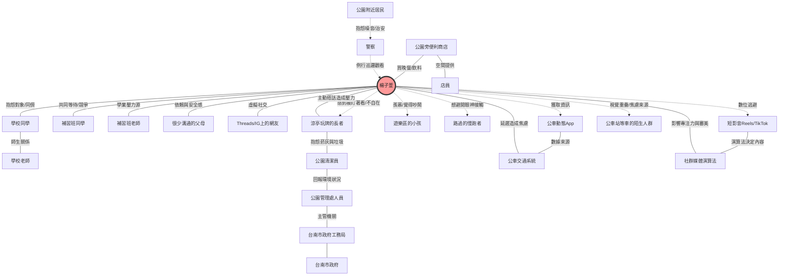
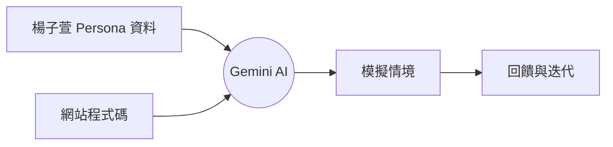

# <span class="text-white drop-shadow-xl text-6xl font-bold">台南公園輕社交平台</span>
<p class="text-white/80 tracking-widest mt-4 block font-light text-2xl">使用者經驗設計個案研究</p>

<!--
各位評審老師、同學大家好，我們是第Ｘ組。今天要與大家分享的主題是「台南公園輕社交平台」。這是一個專為害羞、慢熟的青少年設計的數位解方，旨在幫助他們在公共空間中，找到屬於自己的舒適社交節奏。
-->

---

# 報告大綱

<div class="grid grid-cols-2 gap-8 mt-20">
  <div class="p-6 rounded-2xl bg-white/5 border border-white/10 flex items-center gap-6 group hover:bg-white/10 transition-colors">
    <div class="text-5xl font-black text-white/10 italic group-hover:text-teal-500/20 transition-colors">01</div>
    <div class="text-left">
      <h3 class="font-bold text-2xl text-teal-300">專案介紹</h3>
      <p class="text-sm text-white/40 mt-1 uppercase tracking-widest font-mono">Introduction</p>
    </div>
  </div>
  
  <div class="p-6 rounded-2xl bg-white/5 border border-white/10 flex items-center gap-6 group hover:bg-white/10 transition-colors">
    <div class="text-5xl font-black text-white/10 italic group-hover:text-sky-500/20 transition-colors">02</div>
    <div class="text-left">
      <h3 class="font-bold text-2xl text-sky-300">設計方法</h3>
      <p class="text-sm text-white/40 mt-1 uppercase tracking-widest font-mono">Design Methods</p>
    </div>
  </div>

  <div class="p-6 rounded-2xl bg-white/5 border border-white/10 flex items-center gap-6 group hover:bg-white/10 transition-colors">
    <div class="text-5xl font-black text-white/10 italic group-hover:text-orange-500/20 transition-colors">03</div>
    <div class="text-left">
      <h3 class="font-bold text-2xl text-orange-300">UX 設計解答</h3>
      <p class="text-sm text-white/40 mt-1 uppercase tracking-widest font-mono">Solution</p>
    </div>
  </div>

  <div class="p-6 rounded-2xl bg-white/5 border border-white/10 flex items-center gap-6 group hover:bg-white/10 transition-colors">
    <div class="text-5xl font-black text-white/10 italic group-hover:text-pink-500/20 transition-colors">04</div>
    <div class="text-left">
      <h3 class="font-bold text-2xl text-pink-300">結論</h3>
      <p class="text-sm text-white/40 mt-1 uppercase tracking-widest font-mono">Conclusion</p>
    </div>
  </div>
</div>

<!--
這是我們今天的報告大綱。我們會先從專案的核心目標與價值開始，解釋為什麼我們選擇「研究先行」的策略。接著進入設計方法，展示我們如何透過田野觀察與數據分析來定義問題。第三部分是設計解答，我們會透過使用者故事與實際介面，展示我們的解決方案。最後，我們會分享經過驗證後的設計迭代與專案價值。
-->

---
layout: section
---

# PART I
## 專案介紹 (INTRODUCTION)

<!--
首先進入第一部分：專案介紹。
-->

---

## 候選場域初步掃描

在進入深度研究前，我們針對台南三個具備不同社會特性的場域進行了初步掃描。

<div class="grid grid-cols-3 gap-6 mt-8"> 
  <div v-click class="relative flex flex-col p-5 bg-white/5 rounded-2xl border border-white/10 h-full">
    <div class="flex items-center gap-3 mb-4">
      <div class="p-2 rounded-lg bg-orange-500/20 text-orange-400">
        <div class="mdi-food-marker text-xl"></div>
      </div>
      <h3 class="font-bold text-xl text-orange-300">大東夜市</h3>
    </div>
    <div class="space-y-3 flex-grow">
      <div>
        <p class="text-sm text-white/80 !my-2">特質：庶民生活的煙火氣，高度隨性與混亂。</p>
      </div>
      <div>
        <p class="text-sm text-orange-200/60 !my-2">潛力：解決「擠」與「等」的效率問題。</p>
      </div>
    </div>
    <div class="mt-4 relative group">
      
      <div class="group-hover:opacity-100 transition-opacity absolute bottom-1 right-2 text-[8px] text-white/40 bg-black/60 px-1 rounded">
        LH Wong / CC BY-SA 2.0
      </div>
    </div>
  </div>

  <div v-click class="relative flex flex-col p-5 bg-white/5 rounded-2xl border border-white/10 h-full">
    <div class="flex items-center gap-3 mb-4">
      <div class="p-2 rounded-lg bg-sky-500/20 text-sky-400">
        <div class="mdi-home-city text-xl"></div>
      </div>
      <h3 class="font-bold text-xl text-sky-300">銀同社區</h3>
    </div>   
    <div class="space-y-3 flex-grow">
      <div>
        <p class="text-sm text-white/80 !my-2">特質：老街記憶與歷史積澱，充滿生活感。</p>
      </div>
      <div>
        <p class="text-sm text-sky-200/60 !my-2">潛力：聲音敘事與歷史傳承。</p>
      </div>
    </div>
    <div class="mt-4 relative group">
      
      <div class="group-hover:opacity-100 transition-opacity absolute bottom-1 right-2 text-[8px] text-white/40 bg-black/60 px-1 rounded">
        udn.com
      </div>
    </div>
  </div>

  <div v-click class="relative flex flex-col p-5 bg-white/5 rounded-2xl border border-white/10 h-full">
    <div class="flex items-center gap-3 mb-4">
      <div class="p-2 rounded-lg bg-teal-500/20 text-teal-400">
        <div class="mdi-tree text-xl"></div>
      </div>
      <h3 class="font-bold text-xl text-teal-300">台南公園</h3>
    </div>
    <div class="space-y-3 flex-grow">
      <div>
        <p class="text-sm text-white/80 !my-2">特質：完全去目的化的開放空間，無消費門檻。</p>
      </div>
      <div>
        <p class="text-sm text-teal-200/80 !my-2">潛力：解決「行為異化」與「低壓力社交」。</p>
      </div>
    </div>
    <div class="mt-4 relative group">
      
      <div class="group-hover:opacity-100 transition-opacity absolute bottom-1 right-2 text-[8px] text-white/40 bg-black/60 px-1 rounded">
        338km / CC BY 3.0
      </div>
    </div>
  </div>
</div>

<!--
我們最初挑選了三個地點。大東夜市代表了熱鬧的商業行為，銀同社區代表了歷史與文化的傳承。而台南公園，則是一個非常特殊的「去目的化」空間。
-->

---

## 決策核心：為何選擇台南公園？

<div class="mt-4 mb-10 text-center">
  <p v-click class="text-xl text-gray-400">
    經過場域掃描，我們認為台南公園最具備 UX 研究價值的是其 <span class="text-teal-400 font-bold border-b border-teal-400/50">「去目的化」</span> 的特質。
  </p>
</div>

<div class="flex flex-row gap-6">
  
  <div v-click class="relative p-8 rounded-3xl bg-gradient-to-b from-red-500/10 to-transparent border border-red-500/20 shadow-2xl">
    <div class="mt-4 space-y-4 text-center">
      <h3 class="text-2xl font-bold text-red-300">強烈的角色預設</h3>
      <div class="h-px w-12 bg-white/10 mx-auto"></div>
      <p class="text-white/60 leading-relaxed text-sm">
        夜市的人是「顧客」，社區的人是「鄰居」。<br>
        場域的功能性限制了行為的邊界。
      </p>
      <div class="bg-black/20 p-4 rounded-2xl border border-white/5 text-left">
        <p class="text-xs text-white/40 ">
          <span class="font-bold">局限：</span> 行為模式高度可預測（消費或社交），難以觀察到「社交焦慮」或「孤獨感」等深層心理波動。
        </p>
      </div>
    </div>
  </div>

  <div v-click class="relative p-8 rounded-3xl bg-gradient-to-b from-teal-500/10 to-transparent border border-teal-500/20 shadow-2xl">
    <div class="mt-4 space-y-4 text-center">
      <h3 class="text-2xl font-bold text-teal-300">「去角色化」行為</h3>
      <div class="h-px w-12 bg-teal-500/30 mx-auto"></div>
      <p class="text-white/80 leading-relaxed text-sm">
        唯有在公園，人們可以「只是在那裡」。<br>
        無消費門檻、無固定任務、無角色負擔。
      </p>
      <div class="bg-black/30 p-4 rounded-2xl border border-teal-500/10 text-left">
        <p class="text-xs text-teal-200/80 ">
          <span class="font-bold">核心研究價值：</span> 這種角色的缺失，讓我們能觀察到最純粹的使用者心理狀態，進而定義出「低壓力社交」的設計切點。
        </p>
      </div>
    </div>
  </div>

</div>

<!--
為什麼是台南公園？首先，它是唯一一個「沒有角色包袱」的地方。在夜市你是消費者，在社區你是居民，但在公園，你就是你自己。這讓我們能觀察到最真實的行為。其次，這裡的「數位孤島」現象最嚴重，人們身體在公園，心卻在手機裡。這正是我們想要挑戰的題目：如何透過數位手段，把人拉回現實？
-->

---

## 專案目標與價值主張

<div class="mt-12 grid grid-cols-2 gap-10 items-stretch">
  <div class="relative p-8 rounded-3xl bg-orange-500/5 border border-orange-500/20 shadow-2xl transition-all duration-500 hover:bg-orange-500/10">
    <div class="absolute -top-6 left-10">
      <div class="w-14 h-14 rounded-2xl bg-gradient-to-br from-orange-400 to-red-500 flex items-center justify-center shadow-lg shadow-orange-500/30">
        <mdi-bullseye-arrow class="text-3xl text-white" />
      </div>
    </div>
    <div class="mt-6 space-y-6">
      <h3 class="text-3xl font-bold text-orange-300 tracking-tight">專案目標</h3>
      <div class="h-px w-16 bg-orange-500/30"></div>
      <p class="text-lg text-white/90 leading-relaxed">
        探索如何透過數位平台，幫助青少年在一個感覺 <span class="text-orange-200 font-bold border-b-2 border-orange-500/40">低壓力、舒適、且忠於自我個性</span> 的環境中進行社交。
      </p>
      <div class="p-4 bg-black/40 rounded-2xl border border-orange-500/10">
        <p class="text-sm text-orange-100/70 leading-relaxed">
          以台南公園為核心場域，設計一個讓青少年可以發起或參與小型「氛圍導向」活動的實驗性平台。
        </p>
      </div>
    </div>
  </div>

  <div class="relative p-8 rounded-3xl bg-blue-500/5 border border-blue-500/20 shadow-2xl transition-all duration-500 hover:bg-blue-500/10">
    <div class="absolute -top-6 left-10">
      <div class="w-14 h-14 rounded-2xl bg-gradient-to-br from-blue-400 to-indigo-600 flex items-center justify-center shadow-lg shadow-blue-500/30">
        <mdi-shield-check class="text-3xl text-white" />
      </div>
    </div>
    <div class="mt-6 space-y-6">
      <h3 class="text-3xl font-bold text-blue-300 tracking-tight">價值主張</h3>
      <div class="h-px w-16 bg-blue-500/30"></div>
      <p class="text-lg text-white/80 leading-relaxed">
          與其再推廣一個通用或大型、吵雜或高度社交的活動，我們的設計更專注於<span class="text-blue-200 font-bold border-b-2 border-blue-500/40">解決深層的社交焦慮</span>。
      </p>
      <div class="p-4 bg-black/40 rounded-2xl border border-blue-500/10">
        <p class="text-sm text-blue-100/70 leading-relaxed">
          幫助害羞或慢熟的使用者，在他們自己的步調下，安全地邁出社交的第一步。
        </p>
      </div>
    </div>
  </div>
</div>

<!--
因此，我們的專案目標確立為：在台南公園，為青少年打造一個低壓力的社交平台。我們的核心價值主張是「降低門檻，而非改變個性」。我們不強迫內向者變外向，而是提供一個適合他們的環境，讓他們能安全地邁出第一步。
-->

---
layout: section
---

# PART II
## 設計方法 (DESIGN METHODS)

<!--
接下來進入第二部分：設計方法。我們將展示如何透過嚴謹的質化與量化研究，一步步收斂出我們的設計核心。
-->

---

## 為什麼不直接開發 App？

<div class="mt-4 mb-8 text-center">
  <p v-click class="text-xl text-gray-400 !my-10">
    我們拒絕犯下 <span class="text-red-400 font-bold border-b border-red-400/50">「先射箭再畫靶」</span> 的錯誤。
  </p>
</div>

<div class="flex flex-row gap-12">
  <div v-after class="relative p-8 rounded-3xl bg-gradient-to-b from-red-500/10 to-transparent border border-red-500/20 shadow-2xl">
    <div class="mt-4 space-y-4 text-center">
      <h3 class="text-2xl font-bold text-red-300">先射箭再畫靶</h3>
      <div class="h-px w-12 bg-red-500/30 mx-auto"></div>
      <p class="text-white/80 leading-relaxed">
        許多專案往往先決定了要做一個 App，<br>
        然後才去尋找「可以用在哪裡」。
      </p>
      <div class="bg-black/30 p-4 rounded-2xl border border-red-500/10 text-left">
        <p class="text-sm text-red-200/80 ">
          <span class="font-bold">盲點：</span> 解決了表面的便利性（如：找不到活動），卻忽視了深層的心理門檻（如：不敢參加）。
        </p>
      </div>
    </div>
  </div>

  <div v-click class="relative p-8 rounded-3xl bg-gradient-to-b from-teal-500/10 to-transparent border border-teal-500/20 shadow-2xl">
    <div class="mt-4 space-y-4 text-center">
      <h3 class="text-2xl font-bold text-teal-300">先觀察再設計</h3>
      <div class="h-px w-12 bg-teal-500/30 mx-auto"></div>
      <p class="text-white/80 leading-relaxed">
        走入場域觀察真實行為，<br>
        從「潛在需求」中定義問題。
      </p>
      <div class="bg-black/30 p-4 rounded-2xl border border-teal-500/10 text-left">
        <p class="text-sm text-teal-200/80 ">
          <span class="font-bold">契機：</span> 透過田野調查發現「數位孤島」，從而定義出真正具備社會溫度的設計機會點。
        </p>
      </div>
    </div>
  </div>

</div>

<!--
在專案開始時，我們問了自己一個問題：為什麼不直接開始寫程式？因為我們不想犯「先射箭再畫靶」的錯誤。如果我們預設了「要做一個活動報名 App」，我們就只會看到「活動資訊不足」的問題。但透過先進入場域觀察，我們發現真正的問題不是「沒有活動」，而是「不敢參加」。這個洞察，只有透過研究先行才能獲得。
-->

---
layout: default
class: 'p-8'
---

# 田野觀察：12 組行為圖鑑

我們捕捉了場域中 12 組使用者的「標誌性動作」，揭示他們在公共空間裡的真實狀態。

<div class="grid grid-cols-4 gap-3 mt-6 text-xs leading-tight text-left">

  <div v-click class="border border-white/20 bg-white/5 p-3 rounded hover:bg-white/10 transition">
    <strong class="block mb-1 opacity-90">(U1) 自行車小孩</strong>
    <p class="opacity-70">獨自騎車觀察路人，熟悉路線，隨性靠邊避讓。</p>
  </div>

  <div v-click class="border border-white/20 bg-white/5 p-3 rounded hover:bg-white/10 transition">
    <strong class="block mb-1 opacity-90">(U2) 漫步情侶</strong>
    <p class="opacity-70">牽手同時單手滑手機，低頭緩慢走路對話。</p>
  </div>

  <div v-click class="border border-white/20 bg-white/5 p-3 rounded hover:bg-white/10 transition">
    <strong class="block mb-1 opacity-90">(U3) 長凳友人</strong>
    <p class="opacity-70">分享手機內容大笑，在樹蔭下等人聚合。</p>
  </div>

  <div v-click class="border border-white/20 bg-white/5 p-3 rounded hover:bg-white/10 transition">
    <strong class="block mb-1 opacity-90">(U4) 涼亭長者</strong>
    <p class="opacity-70">儀式化地整理水壺、點菸、抖灰，並將腳架上石椅。</p>
  </div>

  <div v-click class="border border-white/20 bg-white/5 p-3 rounded hover:bg-white/10 transition">
    <strong class="block mb-1 opacity-90">(U5) 玩牌長者</strong>
    <p class="opacity-70">圓形箭頭遷牌、輕點桌面三下，全神貫注局勢。</p>
  </div>

  <div v-click class="border border-white/20 bg-white/5 p-3 rounded hover:bg-white/10 transition">
    <strong class="block mb-1 opacity-90">(U6) 運動長者</strong>
    <p class="opacity-70">持拐杖慢行，主動向年輕人搭話提問確認身份。</p>
  </div>

  <div v-click class="border border-white/20 bg-white/5 p-3 rounded hover:bg-white/10 transition">
    <strong class="block mb-1 opacity-90">(U7) 南二中同學</strong>
    <p class="opacity-70">邊走邊模仿手機短影音內容，引發同伴集體大笑。</p>
  </div>

  <div v-click class="border border-white/20 bg-white/5 p-3 rounded hover:bg-white/10 transition">
    <strong class="block mb-1 opacity-90">(U8) 大學生</strong>
    <p class="opacity-70">專注於手機，頻繁切換遊戲與通訊軟體，接上行動電源。</p>
  </div>

  <div v-click class="border border-white/20 bg-white/5 p-3 rounded hover:bg-white/10 transition">
    <strong class="block mb-1 opacity-90">(U9) 焦慮等車者</strong>
    <p class="opacity-70">不耐煩地擦汗張望，反覆查看公車 App 確認時間。</p>
  </div>

  <div v-click class="border border-white/20 bg-white/5 p-3 rounded hover:bg-white/10 transition">
    <strong class="block mb-1 opacity-90">(U10) 遊樂小孩</strong>
    <p class="opacity-70">奔向滑索設施，與其他同儕互相追逐玩耍。</p>
  </div>

  <div v-click class="border border-white/20 bg-white/5 p-3 rounded hover:bg-white/10 transition">
    <strong class="block mb-1 opacity-90">(U11) 監護家長</strong>
    <p class="opacity-70">在樹蔭下滑手機回訊息，目光偶爾確認小孩狀況。</p>
  </div>

  <div v-click class="border border-white/20 bg-white/5 p-3 rounded hover:bg-white/10 transition">
    <strong class="block mb-1 opacity-90">(U12) 慢跑男子</strong>
    <p class="opacity-70">戴藍牙耳機聽音樂，汗流浹背地規律繞圈跑。</p>
  </div>

</div>

<div v-click class="mt-6 text-sm text-center opacity-80 border-t border-white/10 pt-4 font-mono">
  總結觀察：公園已成為多個「移動式數位島嶼」的交會點，人們普遍透過科技建立心理邊界。
</div>

---

## 田野觀察：公園裡的真實狀態

我們紀錄了 12 組使用者的行為。這些第一手資料揭示了使用者在公園中的真實狀態，以及手機在公共空間中所扮演的角色。

<div class="mt-6 flex flex-row gap-6">
  <div v-click class="group backdrop-blur-md bg-white/5 p-6 rounded-2xl border border-white/10 hover:border-yellow-500/50 transition-all duration-300 flex flex-col">
    <div class="flex justify-between items-start mb-4">
      <div class="px-3 py-1 rounded bg-yellow-500/10 border border-yellow-500/20 text-xs font-mono text-yellow-400 font-bold">U7 南二中同學</div>
      <div class="mdi-cellphone-link text-2xl text-yellow-500/40"></div>
    </div>
    <div class="flex-grow">
      <p class="text-md text-white/80 leading-relaxed">
        「和他的朋友們一邊過馬路一邊看手機... 的同學時不時會模仿手機上短片內容... 到公車站後自成一小群一起等公車。」
      </p>
    </div>
    <div class="mt-6 pt-4 border-t border-white/10">
      <p class="text-sm text-yellow-200/60 flex items-start gap-2">
        <span class="mdi-arrow-right-bold mt-0.5"></span>
        <span>身體在場，但社交焦點在手機內容。</span>
      </p>
    </div>
  </div>

  <div v-click class="group backdrop-blur-md bg-white/5 p-6 rounded-2xl border border-white/10 hover:border-teal-500/50 transition-all duration-300 flex flex-col">
    <div class="flex justify-between items-start mb-4">
      <div class="px-3 py-1 rounded bg-teal-500/10 border border-teal-500/20 text-xs font-mono text-teal-400 font-bold">U8 大學生</div>
      <div class="mdi-shield-account text-2xl text-teal-500/40"></div>
    </div>
    <div class="flex-grow">
      <p class="text-md text-white/80 leading-relaxed">
        「自己一個人在人行道上行走，似乎很專注在自己的手機上... 的手機畫面似乎是遊戲... 開始在聊天軟體與遊戲畫面之間來回切換。」
      </p>
    </div>
    <div class="mt-6 pt-4 border-t border-white/10">
      <p class="text-sm text-teal-200/60 flex items-start gap-2">
        <span class="mdi-arrow-right-bold mt-0.5"></span>
        <span>利用數位裝置建立個人結界，沒有與人交流。</span>
      </p>
    </div>
  </div>

  <div v-click class="group backdrop-blur-md bg-white/5 p-6 rounded-2xl border border-white/10 hover:border-red-500/50 transition-all duration-300 flex flex-col">
    <div class="flex justify-between items-start mb-4">
      <div class="px-3 py-1 rounded bg-red-500/10 border border-red-500/20 text-xs font-mono text-red-400 font-bold">U9 通勤者</div>
      <div class="mdi-account-search text-2xl text-red-500/40"></div>
    </div>
    <div class="flex-grow">
      <p class="text-md text-white/80 leading-relaxed">
        「旁觀的人很多，似乎感到一些焦慮，每隔幾分鐘會一邊張望一邊東西望... 臉上明顯透露出不耐煩，並且手機上開啟大台南公車app。」
      </p>
    </div>
    <div class="mt-6 pt-4 border-t border-white/10">
      <p class="text-sm text-red-200/60 flex items-start gap-2">
        <span class="mdi-arrow-right-bold mt-0.5"></span>
        <span>在人群中感到焦慮，手機成為緩解工具。</span>
      </p>
    </div>
  </div>
</div>

<!--
我們在台南公園進行了長時間的觀察，紀錄了12組使用者的行為。例如 U7 的高中生，雖然聚在一起，但話題和注意力都集中在手機螢幕上。U8 的大學生則是用手機作為一種「社交防護罩」。這些觀察證實了我們的假設：人們雖然身體在公園，但心理上是與環境斷裂的。
-->

---

## 行為分析 (1/4)：原始資料

我們將 12 組使用者的行為量化到 9 個維度上。

<div class="flex justify-center align-center">

</div>

---

## 行為分析 (2/4)：數據準備程式碼

與其用肉眼判斷相似程度，我們編寫 Python 程式碼使用 DBSCAN 演算法對使用者行為進行分群。

```python {all|3-5|8|12-18}
data = {
    'Scale': [
        '負面情緒 - 正面情緒', '不使用科技產品 - 使用科技產品', '獨自一人 - 成群結隊',
        '完全靜止 - 快速移動', '當下分心或並無專心狀態 - 當下專心於某事', '狀態極不舒適 - 狀態舒適',
        '停留時間短 - 停留時間長', '無目的性 - 有目的性', '沒有和公園的設施互動 - 有和公園的設施互動'
    ],
    # Example Data Point (U1: Child Biking)
    '1': [5.0, 4.1, 2.5, 9.1, 4.8, 5.4, 2.0, 0.7, 7.7],
    # ... (Data for U2-U12)
}

import pandas as pd
from sklearn.preprocessing import StandardScaler

df_orig = pd.DataFrame(data)
df_transposed = df_orig.set_index('Scale').transpose()
scaler = StandardScaler()
X_scaled = scaler.fit_transform(df_transposed)
```

<!--
為了客觀分析這些行為，我們將觀察筆記轉化為數據。我們定義了「情緒正負向」、「科技依賴度」、「移動速度」等九個維度，並對每一組使用者進行評分。接著，我們使用標準化處理，確保每個維度在分析時具有相等的權重。
-->

---

## 行為分析 (3/4)：聚類演算法

接著，我們使用 `DBSCAN` 演算法來對標準化後的數據進行分群。DBSCAN 的優點是不需要預設分群數量，能自動找出相似的數據點，並將離群值標記出來。

```python {all|1|6-7}
from sklearn.cluster import DBSCAN

# We need to determine the `eps` (epsilon) value,
# which defines the neighborhood radius for a point.
# After several tests, we found eps=3.0 to be optimal.
dbscan = DBSCAN(eps=3.0, min_samples=2)
dbscan_labels = dbscan.fit_predict(X_scaled)
```

<div v-click class="mt-4 bg-white/5 p-3 rounded-lg border border-white/10 leading-relaxed">
  我們對 <code class="bg-white/10 px-1 rounded">eps</code> 參數進行了多次實驗。
  <br>
  <code class="bg-white/10 px-1 rounded">eps=2.5</code> 時，群體過於分散；
  <code class="bg-white/10 px-1 rounded">eps=3.5</code> 時，則過於集中。
  最終 <code v-mark.circle class="bg-white/10 px-1 rounded font-bold">eps=3.0</code> 產出了最有意義的四個群體與兩個離群值。
</div>
<!--
我們採用 DBSCAN 聚類演算法來分析這些數據。這個算法能幫助我們找出行為模式高度相似的使用者群體。經過參數調整，我們成功識別出了四個主要的使用者群像，這為我們後續的 Persona 設定提供了堅實的數據支持。

(`eps` 決定了鄰近點的搜索半徑)。
-->

---

## 行為分析 (4/4)：聚類結果與洞察

<!-- TODO: we should probably add who these people are -->

`eps=3.0` 的聚類演算法最終將 12 組使用者分為 4 個核心群體與 2 個離群值。這讓我們清晰地看到公園中不同使用者的「存在狀態」。
<v-clicks after>
  <div class="grid grid-cols-2 gap-6 text-left mt-4">
    <div class="backdrop-blur-md bg-white/5 p-5 rounded-xl border border-white/10 flex flex-col h-full transition-all duration-500 hover:bg-white/10">
      <h3 class="font-bold text-red-300 text-lg mb-2">Group A: 高頻流動者</h3>
      <div class="flex flex-wrap gap-2 mb-3">
        <span class="px-2 py-0.5 rounded bg-red-500/20 text-red-300 text-[10px] font-mono border border-red-500/30"><b>U1 (小孩)</b></span>
        <span class="px-2 py-0.5 rounded bg-red-500/20 text-red-300 text-[10px] font-mono border border-red-500/30"><b>U6 (長者)</b></span>
        <span class="px-2 py-0.5 rounded bg-red-500/20 text-red-300 text-[10px] font-mono border border-red-500/30"><b>U8 (大學生)</b></span>
        <span class="px-2 py-0.5 rounded bg-red-500/20 text-red-300 text-[10px] font-mono border border-red-500/30"><b>U12 (跑者)</b></span>
      </div>
      <p class="text-white/70 text-sm leading-relaxed">
        通常處於移動狀態，社交窗口極短，互動必須是非侵入式的。
      </p>
    </div>
    <div class="backdrop-blur-md bg-white/5 p-5 rounded-xl border border-white/10 flex flex-col h-full transition-all duration-500 hover:bg-white/10">
      <h3 class="font-bold text-blue-300 text-lg mb-2">Group B: 封閉社交者</h3>
      <div class="flex flex-wrap gap-2 mb-3">
        <span class="px-2 py-0.5 rounded bg-blue-500/20 text-blue-300 text-[10px] font-mono border border-blue-500/30"><b>U2 (情侶)</b></span>
        <span class="px-2 py-0.5 rounded bg-blue-500/20 text-blue-300 text-[10px] font-mono border border-blue-500/30"><b>U7 (學生)</b></span>
      </div>
      <p class="text-white/70 text-sm leading-relaxed">
        身體在場，心理在別處 (手機或夥伴)，對外部干擾防禦心強。
      </p>
    </div>
    <div class="backdrop-blur-md bg-white/5 p-5 rounded-xl border border-white/10 flex flex-col h-full transition-all duration-500 hover:bg-white/10">
      <h3 class="font-bold text-yellow-300 text-lg mb-2">Group C: 靜態停留者</h3>
      <div class="flex flex-wrap gap-2 mb-3">
        <span class="px-2 py-0.5 rounded bg-yellow-500/20 text-yellow-300 text-[10px] font-mono border border-yellow-500/30"><b>U3 (友伴)</b></span>
        <span class="px-2 py-0.5 rounded bg-yellow-500/20 text-yellow-300 text-[10px] font-mono border border-yellow-500/30"><b>U11 (家長)</b></span>
      </div>
      <p class="text-white/70 text-sm leading-relaxed">
        有穩定停留基礎，是發展微任務或共同興趣社交的潛力股。
      </p>
    </div>
    <div class="backdrop-blur-md bg-white/5 p-5 rounded-xl border border-white/10 flex flex-col h-full transition-all duration-500 hover:bg-white/10">
      <h3 class="font-bold text-purple-300 text-lg mb-2">Group D: 場域佔有者</h3>
      <div class="flex flex-wrap gap-2 mb-3">
        <span class="px-2 py-0.5 rounded bg-purple-500/20 text-purple-300 text-[10px] font-mono border border-purple-500/30"><b>U4 (長者)</b></span>
        <span class="px-2 py-0.5 rounded bg-purple-500/20 text-purple-300 text-[10px] font-mono border border-purple-500/30"><b>U5 (長者)</b></span>
      </div>
      <p class="text-white/70 text-sm leading-relaxed">
        舒適度極高，社交圈已固化，對數位平台介入需求最低。
      </p>
    </div>
  </div>
</v-clicks>

<!--
分析結果顯示，大部分的使用者要嘛在移動（Group A），要嘛處於封閉社交狀態（Group B），要嘛是固定的長輩群體（Group D）。我們發現了一個巨大的「社交真空地帶」：缺乏一個讓這些不同群體之間，能夠以低壓力方式產生連結的機制。這就是我們設計的機會點。
-->

---

## 人物誌 (Persona)：楊子萱

基於觀察數據，我們建立了核心人物誌：一位渴望社交但受限於環境的害羞高中生。

<div class="grid grid-cols-[1fr_2fr] gap-8 text-left items-center pt-4">
  <div class="flex flex-col items-center">
    
    <h3 class="font-bold text-2xl mt-4">楊子萱</h3>
    <p class="text-white/80" style="margin: 4px">16歲，高一學生</p>
    <p class="text-white/70" style="margin: 4px">害羞、慢熟、觀察型</p>
  </div>
  <v-clicks after>
    <div class="grid grid-cols-2 gap-6 text-left mt-4">
      <div class="backdrop-blur-md bg-white/5 p-5 rounded-xl border border-red-500/20 flex flex-col h-full transition-all duration-500">
        <div class="flex mb-3">
          <span class="flex items-center gap-2 px-3 py-1 rounded-full bg-red-500/20 text-red-400 text-xs font-bold border border-red-500/30">
            <carbon-warning class="text-sm" /> 痛點 Pain Points
          </span>
        </div> 
        <ul class="space-y-3 mt-2 list-disc list-outside ml-4 marker:text-red-400 text-sm text-white/80">
          <li>學校社交圈已固化，難以融入。</li>
          <li>大型或吵鬧的活動讓她倍感壓力。</li>
          <li>害怕一個人參加活動會很奇怪。</li>
          <li>不知道如何自然地開啟對話。</li>
        </ul>
      </div>
      <div class="backdrop-blur-md bg-white/5 p-5 rounded-xl border border-green-500/20 flex flex-col h-full transition-all duration-500">
        <div class="flex mb-3">
          <span class="flex items-center gap-2 px-3 py-1 rounded-full bg-green-500/20 text-green-400 text-xs font-bold border border-green-500/30">
            <carbon-need class="text-sm" /> 需求 Needs
          </span>
        </div>
        <ul class="space-y-3 mt-2 list-disc list-outside ml-4 marker:text-green-400 text-sm text-white/80">
          <li>一個能<b>「自然融入」</b>的契機。</li>
          <li>低壓力、不需要強勢社交的活動。</li>
          <li>能預先知道活動氛圍，建立安全感。</li>
          <li>找到步調相似、不必假裝外向的朋友。</li>
        </ul>
      </div>
    </div>
  </v-clicks>
</div>

<!--
根據研究，我們描繪出了「楊子萱」。她16歲，剛上高中，發現班上小圈圈已經固定。她想認識新朋友，但害怕尷尬，不敢一個人參加活動。她需要的不是一個讓她變外向的訓練營，而是一個能讓她「慢慢來」、有安全感的社交契機。
-->

---

## 利害關係人地圖 (Stakeholder Map)

<div class="text-left text-sm">
  <p>我們繪製了一個以楊子萱為核心的網狀地圖，分析影響她行為的各種力量。</p>
</div>

<div class="mt-4 scale-90 origin-top">



</div>

<div class="text-left text-xs mt-4">
  <ul class="space-y-3 list-disc list-outside ml-4 marker:text-blue-400 text-white/80">
    <li class="leading-relaxed">
      <b>數位島嶼</b>：<b>演算法（TechCorp）</b> 與 <b>短影音（Shorts）</b> 是她躲避現實社交的盾牌，但也是造成她分心與焦慮的間接推手。
    </li>
    <li class="leading-relaxed">
      <b>跨世代衝突</b>：<b>玩牌長者（Elders）</b> 與子萱之間的關係是「空間重疊但心理排斥」。長輩的「主動詢問（如：今天沒上課？）」對她而言是微侵略。
    </li>
  </ul>
</div>

<!--
利害關係人地圖顯示，子萱的問題不僅僅是沒有朋友，而是被多重壓力包圍。補習班、學校給予學業壓力；長輩的關心對她來說是社交壓力；而手機裡的短影音則是她逃避這些壓力的避風港。我們的設計必須在這個複雜的網絡中，為她創造一個喘息與連結的空間。
-->

---

## 核心問題定義：Jobs-To-Be-Done (JTBD)

我們使用 JTBD 框架，將子萱模糊的「想交朋友」需求，轉化為 10 個具體的「待辦任務」。

<div class="overflow-x-auto mt-4">
<table class="text-xs text-left w-full border-collapse">
  <thead>
    <tr class="border-b border-white/20 text-teal-300">
      <th class="p-2 w-1/4">情境 (When)</th>
      <th class="p-2 w-1/3">需求 (I want to)</th>
      <th class="p-2 w-1/3">目標 (So I can)</th>
    </tr>
  </thead>
  <tbody class="text-white/80 border-t border-white/10">
    <tr>
      <td class="p-2">在瀏覽校外活動時</td>
      <td class="p-2">能看到不需要強勢社交的活動</td>
      <td class="p-2 font-bold">安心踏出第一步，不會感到尷尬。</td>
    </tr>
    <tr class="border-t border-white/10">
      <td class="p-2">考慮要不要參加陌生活動</td>
      <td class="p-2">先看到活動風格、人數、參加者年齡</td>
      <td class="p-2 font-bold">降低焦慮、心理有底，願意前往。</td>
    </tr>
    <tr class="border-t border-white/10">
      <td class="p-2">在挑選活動時</td>
      <td class="p-2">有明確的「適合新手/安靜的人」標籤</td>
      <td class="p-2 font-bold">不會去到現場覺得格格不入。</td>
    </tr>
    <tr class="border-t border-white/10">
      <td class="p-2">剛到活動現場</td>
      <td class="p-2">有明確的流程指引或緩衝</td>
      <td class="p-2 font-bold">慢慢適應，不被大場面嚇退。</td>
    </tr>
  </tbody>
</table>
</div>

<!--
為了更精準地定義問題，我們採用了 Jobs-To-Be-Done 框架。我們問自己：子萱到底想「雇用」我們的產品來完成什麼「工作」？如表格所示，這些工作非常具體，例如「預知活動氛圍以建立自信」、「避免格格不入的恐懼」。這個框架幫助我們從使用者的目標出發，而不是從功能出發來思考設計。
-->

---

## 核心問題定義：How Might We (HMW)

基於 JTBD，我們發想了 12 個設計機會點 (HMW)，引導我們進入解決方案的發想。

<v-clicks after>
  <div class="grid grid-cols-2 gap-4 text-left mt-4"> 
    <div class="backdrop-blur-md bg-white/5 p-5 rounded-xl border border-white/10 flex flex-col h-full transition-all duration-500">
      <div class="flex mb-3">
        <span class="px-2 py-0.5 rounded bg-yellow-500/20 text-yellow-300 text-[10px] font-mono border border-yellow-500/30">
          <b>HMW 3</b>
        </span>
      </div>
      <h3 class="font-bold text-yellow-300 text-lg mb-2">社交與隱私</h3>
      <p class="text-white/80 text-sm leading-relaxed">
        朋友群訊息爆量時，我們如何設計能讓人短暫停下回訊息、不影響人流、又不造成視線壓力的小節點？
      </p>
    </div>
    <div class="backdrop-blur-md bg-white/5 p-5 rounded-xl border border-white/10 flex flex-col h-full transition-all duration-500">
      <div class="flex mb-3">
        <span class="px-2 py-0.5 rounded bg-teal-500/20 text-teal-300 text-[10px] font-mono border border-teal-500/30">
          <b>HMW 5</b>
        </span>
      </div>
      <h3 class="font-bold text-teal-300 text-lg mb-2">環境心理</h3>
      <p class="text-white/80 text-sm leading-relaxed">
        附近有人經過、視線不舒服時，如何以座位角度、背靠與微邊界，給她一個隱私？
      </p>
    </div>
    <div class="backdrop-blur-md bg-white/5 p-5 rounded-xl border border-white/10 flex flex-col h-full transition-all duration-500">
      <div class="flex mb-3">
        <span class="px-2 py-0.5 rounded bg-red-500/20 text-red-300 text-[10px] font-mono border border-red-500/30">
          <b>HMW 11</b>
        </span>
      </div>
      <h3 class="font-bold text-red-300 text-lg mb-2">空間控制感</h3>
      <p class="text-white/80 text-sm leading-relaxed">
        如何讓她在不與人交談的情況下，能預約公園中隱蔽且有充電的特定座椅或小空間？
      </p>
    </div>
    <div class="backdrop-blur-md bg-white/5 p-5 rounded-xl border border-white/10 flex flex-col h-full transition-all duration-500">
      <div class="flex mb-3">
        <span class="px-2 py-0.5 rounded bg-purple-500/20 text-purple-300 text-[10px] font-mono border border-purple-500/30">
          <b>HMW 12</b>
        </span>
      </div>
      <h3 class="font-bold text-purple-300 text-lg mb-2">氛圍維持</h3>
      <p class="text-white/80 text-sm leading-relaxed">
        在認真的時候，看要怎麼鼓勵所有進入該區域的人維持低語或靜默，避免不當的打擾？
      </p>
    </div>
  </div>
</v-clicks>

<!--
有了 JTBD 後，我們進一步轉化為「我們該如何 (How Might We)」的問句。例如 HMW 11，我們思考如何讓使用者在不需與人交談的情況下，就能預約到一個讓她安心的空間。這些問題直接啟發了我們後來在 App 中設計的「預約」與「狀態顯示」功能。
-->

---
layout: section
---

# PART III
## UX 設計解答 (UX DESIGN SOLUTION)

<!--
現在進入第三部分：UX 設計解答。在這個章節，我們會展示最終的 App 設計是如何回應前面定義出的種種問題，並透過一個完整的使用者故事與實際程式碼，帶大家體驗我們的解決方案。
-->
---

## 解決方案概覽：視覺與架構

<div class="grid grid-cols-[300px_1fr] gap-12 mt-6 items-center h-full">
  <div class="relative justify-self-center">
    <div class="absolute -inset-10 bg-teal-500/15 rounded-full blur-[80px]"></div>
    <div class="relative group">
      <div class="absolute -inset-1 bg-gradient-to-b from-white/20 to-transparent rounded-[2.5rem] blur opacity-50"></div>
      
    </div>
  </div>

  <div class="space-y-4 -mt-15">
      <p class="text-gray-400 text-lg">基於 React 開發，以深色調與柔和動態背景建立心理安全感。</p>
    <div class="grid grid-cols-1 gap-4">
      <div class="flex items-center gap-5 p-2 rounded-2xl bg-white/5 border border-white/10 hover:bg-white/10 transition-colors">
        <div class="flex-shrink-0 w-12 h-12 flex items-center justify-center rounded-xl bg-teal-500/20 text-teal-400 shadow-lg shadow-teal-500/10"><carbon-settings-adjust class="text-2xl" /></div>
        <div>
          <h4 class="font-bold text-white text-lg">探索活動</h4>
          <p class="text-sm text-gray-400 !my-1">獨創「社交強度」篩選器，精準對接心理舒適區</p>
        </div>
      </div>
      <div class="flex items-center gap-5 p-2 rounded-2xl bg-white/5 border border-white/10 hover:bg-white/10 transition-colors">
        <div class="flex-shrink-0 w-12 h-12 flex items-center justify-center rounded-xl bg-orange-500/20 text-orange-400 shadow-lg shadow-orange-500/10"><carbon-pedestrian-child class="text-2xl" /></div>
        <div>
          <h4 class="font-bold text-white text-lg">發起活動</h4>
          <p class="text-sm text-gray-400 !my-1">去中心化的主辦流程，讓每個人都能輕鬆發聲</p>
        </div>
      </div>
      <div class="flex items-center gap-5 p-2 rounded-2xl bg-white/5 border border-white/10 hover:bg-white/10 transition-colors">
        <div class="flex-shrink-0 w-12 h-12 flex items-center justify-center rounded-xl bg-purple-500/20 text-purple-400 shadow-lg shadow-purple-500/10"><carbon-face-activated class="text-2xl" /></div>
        <div>
          <h4 class="font-bold text-white text-lg">個人檔案</h4>
          <p class="text-sm text-gray-400 !my-1">視覺化興趣標籤與慢熟標記，取代壓力文字敘述</p>
        </div>
      </div>
      <div class="flex items-center gap-5 p-2 rounded-2xl bg-white/5 border border-white/10 hover:bg-white/10 transition-colors">
        <div class="flex-shrink-0 w-12 h-12 flex items-center justify-center rounded-xl bg-blue-500/20 text-blue-400 shadow-lg shadow-blue-500/10"><carbon-map class="text-2xl" /></div>
        <div>
          <h4 class="font-bold text-white text-lg">安全與導航</h4>
          <p class="text-sm text-gray-400 !my-1">提供集合地標實景引導，消除抵達現場的焦慮感</p>
        </div>
      </div>
    </div>
  </div>
</div>

---
title: 子萱的故事：孤單的觀察者 (1/12)
---

<div class="grid grid-cols-[1fr_320px] gap-12 items-center h-full">
  <div class="space-y-6">
    <div class="inline-block px-3 py-1 rounded bg-white/10 border border-white/20 text-xs font-mono tracking-widest text-gray-400">SCENE 01: 校園一角</div>
    <h2 class="text-4xl font-bold text-white">子萱的故事：<span class="text-gray-400">孤單的觀察者</span></h2>
    <p class="text-lg leading-relaxed opacity-80">16 歲的楊子萱，升上高中已經一年多了，沒有和國中好友上同一所學校的她在人群當中形同隱身。沒有被霸凌，但也沒有朋友。</p>
    <div class="relative mt-8">
      <div class="absolute -left-4 top-0 bottom-0 w-1 bg-gray-500/50"></div>
      <blockquote class="pl-6 py-2 text-md !border-0 text-gray-300 bg-white/5 rounded-r-lg">性格害羞、慢熟的她，常常獨自一人站在走廊，看著同學們三五成群地聊天，心裡渴望著連結，卻不知如何開口。</blockquote>
    </div>
  </div>
  <div class="relative justify-self-center">
    <div class="absolute -inset-4 bg-gray-500/10 rounded-full blur-3xl"></div>
    
  </div>
</div>

---
title: 子萱的故事：渴望與退縮 (2/12)
---

<div class="grid grid-cols-[1fr_320px] gap-12 items-center h-full">
  <div class="space-y-6">
    <div class="inline-block px-3 py-1 rounded bg-red-500/10 border border-red-500/20 text-xs font-mono tracking-widest text-red-400">SCENE 02: 房間裡的微光</div>
    <h2 class="text-4xl font-bold text-white">子萱的故事：<span class="text-red-400">渴望與退縮</span></h2>
    <p class="text-lg leading-relaxed opacity-80">回到房間，滑著 IG，看到以前最要好的國中同學發了新動態，已經有了自己的新小團體。</p>
    <div class="relative mt-8">
      <div class="absolute -left-4 top-0 bottom-0 w-1 bg-red-500/50"></div>
      <blockquote class="pl-6 py-2 text-md !border-0 text-red-300 bg-white/5 rounded-r-lg">「班上的小圈圈大致已經形成了，自己突然又硬要加入別人，有點說不上的尷尬。想到這邊，子萱又打退堂鼓了...」</blockquote>
    </div>
  </div>
  <div class="relative justify-self-center">
    <div class="absolute -inset-4 bg-red-500/10 rounded-full blur-3xl"></div>
    
  </div>
</div>

---
title: 子萱的故事：迷失在選擇中 (3/12)
---

<div class="grid grid-cols-[1fr_320px] gap-12 items-center h-full">
  <div class="space-y-6">
    <div class="inline-block px-3 py-1 rounded bg-orange-500/10 border border-orange-500/20 text-xs font-mono tracking-widest text-orange-400">SCENE 03: 佈告欄前</div>
    <h2 class="text-4xl font-bold text-white">子萱的故事：<span class="text-orange-400">迷失在選擇中</span></h2>
    <p class="text-lg leading-relaxed opacity-80">想著透過加入社團認識朋友，但在布告欄前看著各社團百花撩亂的海報，她遲遲無法下決定。</p>
    <div class="relative mt-8">
      <div class="absolute -left-4 top-0 bottom-0 w-1 bg-orange-500/50"></div>
      <blockquote class="pl-6 py-2 text-md !border-0 text-orange-300 bg-white/5 rounded-r-lg">「海報並沒有各種社員的資訊... 萬一裡面同學和自己電波對不上怎麼辦？社團可是要待滿整個學期的！」</blockquote>
    </div>
  </div>
  <div class="relative justify-self-center">
    <div class="absolute -inset-4 bg-orange-500/10 rounded-full blur-3xl"></div>
    
  </div>
</div>

---
title: 子萱的故事：發現新契機 (4/12)
---

<div class="grid grid-cols-[1fr_320px] gap-12 items-center h-full">
  <div class="space-y-6">
    <div class="inline-block px-3 py-1 rounded bg-yellow-500/10 border border-yellow-500/20 text-xs font-mono tracking-widest text-yellow-400">SCENE 04: 轉角的偶遇</div>
    <h2 class="text-4xl font-bold text-white">子萱的故事：<span class="text-yellow-400">發現新契機</span></h2>
    <p class="text-lg leading-relaxed opacity-80">放學後，子萱在學校角落偶然看見了一個顯眼的海報，介紹了一款主打「無壓力」的社交平台。</p>
    <div class="relative mt-8">
      <div class="absolute -left-4 top-0 bottom-0 w-1 bg-yellow-500/50"></div>
      <blockquote class="pl-6 py-2 text-md !border-0 text-yellow-300 bg-white/5 rounded-r-lg">「子萱試探性的掃描海報上的 QR code，進入程式一探究竟。這或許是踏出全新社交行動的第一步！」</blockquote>
    </div>
  </div>
  <div class="relative justify-self-center">
    <div class="absolute -inset-4 bg-yellow-500/10 rounded-full blur-3xl"></div>
    
  </div>
</div>

---
title: 子萱的故事：初次接觸 (5/12)
---

<div class="grid grid-cols-[1fr_320px] gap-12 items-center h-full">
  <div class="space-y-6">
    <div class="inline-block px-3 py-1 rounded bg-green-500/10 border border-green-500/20 text-xs font-mono text-green-400">SCENE 05: 進入應用程式</div>
    <h2 class="text-4xl font-bold text-white">子萱的故事：<span class="text-green-400">初次接觸</span></h2>
    <p class="text-lg leading-relaxed opacity-80">子萱打開 App，映入眼簾的是柔和的歡迎畫面。點擊『探索活動』，活動卡片整齊排列。</p>
    <div class="relative mt-8">
      <div class="absolute -left-4 top-0 bottom-0 w-1 bg-green-500/50"></div>
      <blockquote class="pl-6 py-2 text-md !border-0  text-green-300 bg-white/5 rounded-r-lg">「這真的有比學校社團還要好嗎？活動看起來好多，我該從哪裡開始？」</blockquote>
    </div>
  </div>
  <div class="relative justify-self-center h-[480px] w-[240px]">
    <div class="absolute -inset-4 bg-green-500/10 rounded-full blur-3xl"></div>
    
    
  </div>
</div>

---
title: 子萱的故事：嘗試與卻步 (6/12)
---

<div class="grid grid-cols-[1fr_320px] gap-12 items-center h-full">
  <div class="space-y-6">
    <div class="inline-block px-3 py-1 rounded bg-red-500/10 border border-red-500/20 text-xs font-mono text-red-400">SCENE 06: 探索與猶豫</div>
    <h2 class="text-4xl font-bold text-white">子萱的故事：<span class="text-red-400">嘗試與卻步</span></h2>
    <p class="text-lg leading-relaxed opacity-80">她點開一個「大地遊戲」，發現標籤寫著「高互動」且「適合外向者」。</p>
    <div class="relative mt-8">
      <div class="absolute -left-4 top-0 bottom-0 w-1 bg-red-500/50"></div>
      <blockquote class="pl-6 py-2 text-md !border-0  text-red-300 bg-white/5 rounded-r-lg">「這種場合... 需要快速破冰，我可能還是沒辦法融入吧。」她感到一陣壓力，手指懸在半空。</blockquote>
    </div>
  </div>
  <div class="relative justify-self-center h-[480px] w-[240px]">
    <div class="absolute -inset-4 bg-red-500/10 rounded-full blur-3xl"></div>
    
    
  </div>
</div>

---
title: 子萱的故事：掌握主控權 (7/12)
---

<div class="grid grid-cols-[1fr_320px] gap-12 items-center h-full">
  <div class="space-y-6">
    <div class="inline-block px-3 py-1 rounded bg-teal-500/10 border border-teal-500/20 text-xs font-mono text-teal-400">SCENE 07: 篩選與鎖定</div>
    <h2 class="text-4xl font-bold text-white">子萱的故事：<span class="text-teal-400">掌握主控權</span></h2>
    <p class="text-lg leading-relaxed opacity-80">還好有篩選器！她拉動拉桿將社交強度調低。出現了一個「靜態攝影散步」。</p>
    <div class="relative mt-8">
      <div class="absolute -left-4 top-0 bottom-0 w-1 bg-teal-500/50"></div>
      <blockquote class="pl-6 py-2 text-md !border-0  text-teal-300 bg-white/5 rounded-r-lg">「適合新手、歡迎安靜的人... 這正是我要的！不用自我介紹，只要一起拍照就好。」</blockquote>
    </div>
  </div>
  <div class="relative justify-self-center h-[480px] w-[240px]">
    <div class="absolute -inset-4 bg-teal-500/10 rounded-full blur-3xl"></div>
    
    
  </div>
</div>

---

## 解決方案：活動篩選邏輯

<div class="grid grid-cols-[1.5fr_1fr] gap-4 mt-2">

<div>

我們在 `Activities.tsx` 中實作了強大的篩選邏輯，確保子萱能精確找到符合她心理預期的活動。

<div class="text-xs">

```tsx {all|3-8|4}
// Activities.tsx: 篩選邏輯
const filteredActivities = activities.filter((activity) => {
  const nameMatch = /* ... */
  const levelMatch = /* ... */
  const tagsMatch = /* ... */
  const groupSizeMatch = /* ... */
  const dateMatch = /* ... */
  const verificationMatch = /* ... */

  return nameMatch && levelMatch && tagsMatch 
      && dateMatch && groupSizeMatch && verificationMatch;
});
```

</div>

</div>

<div class="flex items-center justify-center">
  
</div>

</div>

<!--
這是「探索活動」頁面背後的程式碼。我們可以看到 `filteredActivities` 函式中，最關鍵的就是 `levelMatch` 這一段。它將使用者設定的社交強度範圍，與資料庫中的活動屬性進行比對。這確保了子萱永遠不會看到那些會讓她壓力山大的大型聯誼活動。
-->

---
title: 子萱的故事：建立自我與承諾 (8/12)
---

<div class="grid grid-cols-[1fr_320px] gap-12 items-center h-full">
  <div class="space-y-6">
    <div class="inline-block px-3 py-1 rounded bg-indigo-500/10 border border-indigo-500/20 text-xs font-mono text-indigo-400">SCENE 08: 確認與加入</div>
    <h2 class="text-4xl font-bold text-white">子萱的故事：<span class="text-indigo-400">建立自我與承諾</span></h2>
    <p class="text-lg leading-relaxed opacity-80">看了看留言區溫暖的回覆，她終於鼓起勇氣。填寫了簡單的個性檔案，按下「參加」。</p>
    <div class="relative mt-8">
      <div class="absolute -left-4 top-0 bottom-0 w-1 bg-indigo-500/50"></div>
      <blockquote class="pl-6 py-2 text-md !border-0  text-indigo-300 bg-white/5 rounded-r-lg">「在『我的活動』裡看到它出現的那一刻，我覺得自己邁出了一大步。」</blockquote>
    </div>
  </div>
  <div class="relative justify-self-center h-[480px] w-[240px]">
    <div class="absolute -inset-4 bg-indigo-500/10 rounded-full blur-3xl"></div>
    
    
    
  </div>
</div>

---
title: 子萱的故事：踏出第一步 (9/12)
---

<div class="grid grid-cols-[1fr_320px] gap-12 items-center h-full">
  <div class="space-y-6">
    <div class="inline-block px-3 py-1 rounded bg-blue-500/10 border border-blue-500/20 text-xs font-mono tracking-widest text-blue-400">SCENE 09: 出發前的焦慮</div>
    <h2 class="text-4xl font-bold text-white">子萱的故事：<span class="text-blue-400">踏出第一步</span></h2>
    <p class="text-lg leading-relaxed opacity-80">活動當天，子萱在公園入口徘徊，心中仍有不安：「萬一他們不喜歡我怎麼辦？」</p>
    <div class="relative mt-8">
      <div class="absolute -left-4 top-0 bottom-0 w-1 bg-blue-500/50"></div>
      <blockquote class="pl-6 py-2 text-md !border-0  text-blue-300 bg-white/5 rounded-r-lg">「直到手機裡跳出其他的活動參加者傳來的關心訊息，才讓子萱安心了不少，終於會合。」</blockquote>
    </div>
  </div>
  <div class="relative justify-self-center">
    <div class="absolute -inset-4 bg-blue-500/10 rounded-full blur-3xl"></div>
    
  </div>
</div>

---
title: 子萱的故事：溫暖的迎接 (10/12)
---

<div class="grid grid-cols-[1fr_320px] gap-12 items-center h-full">
  <div class="space-y-6">
    <div class="inline-block px-3 py-1 rounded bg-indigo-500/10 border border-indigo-500/20 text-xs font-mono tracking-widest text-indigo-400">SCENE 10: 破冰</div>
    <h2 class="text-4xl font-bold text-white">子萱的故事：<span class="text-indigo-400">溫暖的迎接</span></h2>
    <p class="text-lg leading-relaxed opacity-80">一到地點大家已經到了。沒有尷尬的冷場，大家熱情地對著子萱揮手，氣氛自然友善。</p>
    <div class="relative mt-8">
      <div class="absolute -left-4 top-0 bottom-0 w-1 bg-indigo-500/50"></div>
      <blockquote class="pl-6 py-2 text-md !border-0  text-indigo-300 bg-white/5 rounded-r-lg">「子萱有點不好意思的小跑步過去與大家一一打招呼，但心中的大石早已放下不少。」</blockquote>
    </div>
  </div>
  <div class="relative justify-self-center">
    <div class="absolute -inset-4 bg-indigo-500/10 rounded-full blur-3xl"></div>
    
  </div>
</div>

---
title: 子萱的故事：自然的連結 (11/12)
---

<div class="grid grid-cols-[1fr_320px] gap-12 items-center h-full">
  <div class="space-y-6">
    <div class="inline-block px-3 py-1 rounded bg-purple-500/10 border border-purple-500/20 text-xs font-mono tracking-widest text-purple-400">SCENE 11: 並肩同行</div>
    <h2 class="text-4xl font-bold text-white">子萱的故事：<span class="text-purple-400">自然的連結</span></h2>
    <p class="text-lg leading-relaxed opacity-80">黃昏時分，大家沿著步道慢慢散步。不用刻意找話題，光是討論夕陽的角度就很自然。</p>
    <div class="relative mt-8">
      <div class="absolute -left-4 top-0 bottom-0 w-1 bg-purple-500/50"></div>
      <blockquote class="pl-6 py-2 text-md !border-0  text-purple-300 bg-white/5 rounded-r-lg">「一邊用手機拍下夕陽，一邊聊著興趣，子萱自然地走在隊伍中央，享受這份寧靜。」</blockquote>
    </div>
  </div>
  <div class="relative justify-self-center">
    <div class="absolute -inset-4 bg-purple-500/10 rounded-full blur-3xl"></div>
    
  </div>
</div>

---
title: 子萱的故事：歸屬感 (12/12)
---

<div class="grid grid-cols-[1fr_320px] gap-12 items-center h-full">
  <div class="space-y-6">
    <div class="inline-block px-3 py-1 rounded bg-pink-500/10 border border-pink-500/20 text-xs font-mono tracking-widest text-pink-400">SCENE 12: 收穫</div>
    <h2 class="text-4xl font-bold text-white">子萱的故事：<span class="text-pink-400">歸屬感</span></h2>
    <p class="text-lg leading-relaxed opacity-80">活動結束後，大家在草地上小野餐。子萱意識到，這就是她一直在尋找的社交節奏。</p>
    <div class="relative mt-8">
      <div class="absolute -left-4 top-0 bottom-0 w-1 bg-pink-500/50"></div>
      <blockquote class="pl-6 py-2 text-md !border-0  text-pink-300 bg-white/5 rounded-r-lg">「子萱被笑聲與燈光包圍，感覺自己終於有了一群可以約出來的朋友，心中充滿暖意。」</blockquote>
    </div>
  </div>
  <div class="relative justify-self-center">
    <div class="absolute -inset-4 bg-pink-500/10 rounded-full blur-3xl"></div>
    
  </div>
</div>

---

## AI 輔助驗證與迭代

我們並非憑空想像使用者的反應。我們將 Persona 資料與網站程式碼輸入 Gemini AI，進行了一場深度的角色扮演測試。

<div class="mt-8 flex justify-center">
<div class="w-2/3">



</div>
</div>

<div class="mt-8 text-sm text-left backdrop-blur-sm bg-white/5 p-4 rounded-lg border border-white/10">
  <p class="font-bold">為什麼使用 AI 角色扮演？</p>
  <p class="text-white/80 mt-2">透過 AI 模擬楊子萱在面對網站的設計時的心理活動，我們能挖掘出人類設計師容易忽略的微小焦慮。</p>
</div>

<!--
在設計完成初步原型後，我們做了一個大膽的嘗試。我們把楊子萱的人物誌設定，以及我們寫好的網站程式碼，全部餵給了 Gemini AI。請它扮演楊子萱，實際「使用」我們的網站，並告訴我們她的真實感受。這讓我們能從最真實的視角，檢視我們的設計是否到位。
-->

---

## AI 建議：更符合青少年的個人檔案設計

<div class="grid grid-cols-[1fr_2fr] gap-8 mt-4 items-center h-[100px]">
  <div v-click class="flex flex-col items-center space-y-4">
    <div class="px-3 py-1 rounded bg-red-500/10 border border-red-500/20 text-xs font-mono text-red-400">BEFORE</div>
    <div class="relative group p-4 border border-red-500/20 rounded-lg">
      <div class="absolute -inset-4 bg-red-500/5 rounded-lg blur-2xl"></div>
      
      <div class="mt-2 text-center text-[10px] text-red-300/70 font-mono">單調且暴露隱私</div>
    </div>
  </div>

  <div v-click="2" class="flex flex-col items-center space-y-4">
    <div class="px-3 py-1 rounded bg-teal-500/10 border border-teal-500/20 text-xs font-mono text-teal-400 font-bold">AFTER</div>
    <div class="relative flex gap-3 p-4 bg-teal-500/5 border border-teal-500/20 rounded-lg backdrop-blur-sm">
      <div class="absolute -inset-4 bg-teal-500/10 rounded-lg blur-3xl"></div>
      <div class="relative">
        
        <span 
          v-mark.circle.red="3"
          class="absolute top-58% left-46% w-20 h-30"
        ></span>
        <div class="mt-2 text-center text-[10px] text-teal-300/70 font-mono">自定義資料可見度</div>
      </div>
      <div class="relative">
        
        <div class="mt-2 text-center text-[10px] text-teal-300/70 font-mono">個性風格滑桿</div>
      </div>
    </div>
  </div>
</div>
<!--
AI 告訴我們，內向者在見面前最怕「無話可說」。如果能在檔案裡就看到對方的生活照、星座或最愛的三個興趣，會大大降低心理門檻。因此我們將原本單調的檔案改版，加入了更多「生活感」的元素，讓使用者在不開口的情況下，也能建立立體的個人形象。
-->

---

## AI 建議：社交安全與連結

AI 的建議讓我們意識到，社交安全不只是「保護」，更是「賦予掌控感」與「獲得回饋」。

<div class="grid grid-cols-3 gap-4 text-left mt-2">
  
<div v-click class="p-3 bg-teal-500/10 border border-teal-500/20 rounded-lg flex flex-col items-center">
  <h4 class="font-bold mb-2 text-teal-300 w-full text-left text-xs">1. 朋友互動與筆記</h4>
  
  <div class="text-white/80 leading-tight w-full">
    <p class="text-[10px] text-teal-200 ">「我怕下次見面沒話聊。」</p>
    <p class="text-[10px] text-white/60 mt-1">👉 **實作：** 私人筆記記錄同好細節，並整合即時訊息與活動邀請功能。</p>
  </div>
</div>

<div v-click class="p-3 bg-red-500/10 border border-red-500/20 rounded-lg flex flex-col items-center">
  <h4 class="font-bold mb-2 text-red-300 w-full text-left text-xs">2. 安全地圖與脫身指南</h4>
  
  <div class="text-white/80 leading-tight w-full">
    <p class="text-[10px] text-red-200 ">「怕被困在尷尬場合。」</p>
    <p class="text-[10px] text-white/60 mt-1">👉 **實作：** 公園安全照明地圖與禮貌脫身話術，確保物理與心理的雙重安全。</p>
  </div>
</div>

<div v-click class="p-3 bg-blue-500/10 border border-blue-500/20 rounded-lg flex flex-col items-center">
  <h4 class="font-bold mb-2 text-blue-300 w-full text-left text-xs">3. 多維度回饋系統</h4>
  
  <div class="text-white/80 leading-tight w-full">
    <p class="text-[10px] text-blue-200 ">「我表現得好嗎？」</p>
    <p class="text-[10px] text-white/60 mt-1">👉 **實作：** 引入同儕肯定系統，在通知中傳達「你是安靜但讓人安心的夥伴」。</p>
  </div>
</div>

</div>

<!--
透過 AI 的角色扮演，我們實作了許多具備人性的功能。例如「朋友筆記」讓使用者可以記錄對方的喜好；「安全地圖」標示了照明區與求助電話；而最溫暖的是「同儕回饋」，當子萱收到通知說有人覺得她是個讓人安心的同行者時，這比任何功能都能降低她的社交焦慮。
-->

---
layout: section
---

# PART IV
## 結論 (CONCLUSION)

<!--
最後，來到我們的結論部分。我們將總結這個專案的價值，以及我們從中學到的事情。
-->

---

## 專案價值

<div class="grid grid-cols-3 gap-8 mt-25">
  <div class="relative group p-6 rounded-3xl bg-white/5 border border-white/10 hover:bg-white/10 transition-all duration-500 shadow-xl">
    <div class="absolute -top-6 left-6">
      <div class="w-14 h-14 rounded-2xl bg-gradient-to-br from-green-400 to-teal-600 flex items-center justify-center shadow-lg shadow-green-500/20">
        <mdi-account-heart class="text-3xl text-white" />
      </div>
    </div>
    <div class="mt-6 space-y-3">
      <h3 class="font-bold text-2xl text-green-400">對使用者</h3>
      <p class="text-md leading-relaxed text-gray-300">
        打造一個<span class="text-white font-semibold">「社交新手村」</span>。在這裡，犯錯是被允許的，沉默是沒關係的。它賦予了使用者在公共空間中「合法」獨處或進行輕社交的權利。
      </p>
    </div>
  </div>

  <div class="relative group p-6 rounded-3xl bg-white/5 border border-white/10 hover:bg-white/10 transition-all duration-500 shadow-xl">
    <div class="absolute -top-6 left-6">
      <div class="w-14 h-14 rounded-2xl bg-gradient-to-br from-orange-400 to-yellow-600 flex items-center justify-center shadow-lg shadow-orange-500/20">
        <mdi-pine-tree class="text-3xl text-white" />
      </div>
    </div>
    <div class="mt-6 space-y-3">
      <h3 class="font-bold text-2xl text-orange-400">對公園</h3>
      <p class="text-md leading-relaxed text-gray-300">
        讓被忽視的青少年族群重新與公園產生連結。公園不再只是長輩的運動場，更是年輕人建立歸屬感的<span class="text-white font-semibold">第三空間</span>。
      </p>
    </div>
  </div>

  <div class="relative group p-6 rounded-3xl bg-white/5 border border-white/10 hover:bg-white/10 transition-all duration-500 shadow-xl">
    <div class="absolute -top-6 left-6">
      <div class="w-14 h-14 rounded-2xl bg-gradient-to-br from-sky-400 to-blue-600 flex items-center justify-center shadow-lg shadow-sky-500/20">
        <mdi-share-variant class="text-3xl text-white" />
      </div>
    </div>
    <div class="mt-6 space-y-3">
      <h3 class="font-bold text-2xl text-sky-400">對社會</h3>
      <p class="text-md leading-relaxed text-gray-300">
        緩解現代孤獨感的可能解方。它證明了，有時候我們需要的不是更多的連結，而是<span class="text-white font-semibold">「更舒適的連結」</span>。
      </p>
    </div>
  </div>
</div>

<!--
總結來說，這個專案的價值體現在三個層面。對使用者而言，它是一個可以放心犯錯的「社交新手村」。對公園而言，它重新活化了被忽略的青少年族群。而對整個社會來說，它提供了一個緩解孤獨感的新模式——證明了「更舒適的連結」遠比「更多的連結」來得重要。
-->

---
layout: center
class: text-center
---

# <span class="bg-gradient-to-r from-blue-300 to-emerald-300 bg-clip-text text-transparent font-bold text-5xl tracking-tighter">認識朋友，可以是一種舒適的選擇。</span>

<p class="mt-20 text-white/40 font-mono text-xs tracking-[0.4em] uppercase font-light">Thank you</p>

<!--
我們相信，透過好的設計，認識朋友，可以是一種舒適的選擇。這就是我們今天的報告。謝謝大家。
-->